---
## Front matter
lang: ru-RU
title: Презентация по выполнению стороннего курса
subtitle: Информационная безопасность
author:
  - Арбатова В. П.
institute:
  - Российский университет дружбы народов, Москва, Россия
date: 12 мая 2025

## i18n babel
babel-lang: russian
babel-otherlangs: english

## Formatting pdf
toc: false
toc-title: Содержание
slide_level: 2
aspectratio: 169
section-titles: true
theme: metropolis
header-includes:
 - \metroset{progressbar=frametitle,sectionpage=progressbar,numbering=fraction}
---

# Выполнение заданий

## Этап 1

##

HTTPS - протокол прикладного уровня, выбираю его

{#fig:001 width=70%}

##

TCP работает на транспортном уровне

{#fig:001 width=70%}

##

Выбираю все корректные номера

{#fig:001 width=70%}

##

DNS сервер сопоставляет IP адреса доменным именам

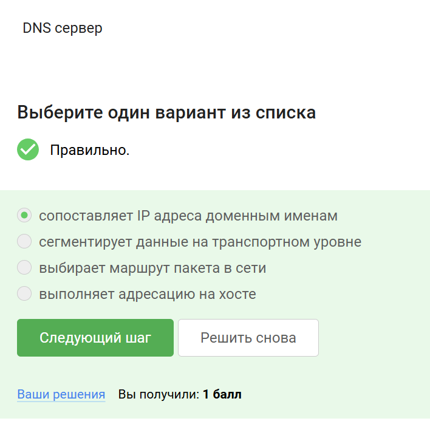{#fig:001 width=70%}

##

Эта модель работает по такой последовательности, которую я выбрала

{#fig:001 width=70%}

##

Этот протокол передает данные в открытом виде

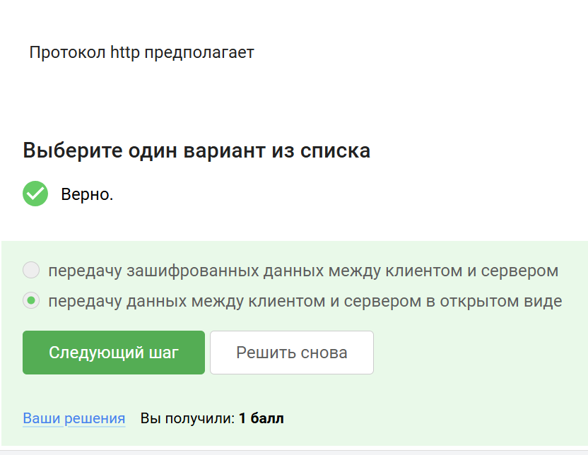{#fig:001 width=70%}

##

Так как данные в открытом виде, шифрование не нужно, задачи этого протокола не включают аутентификацию

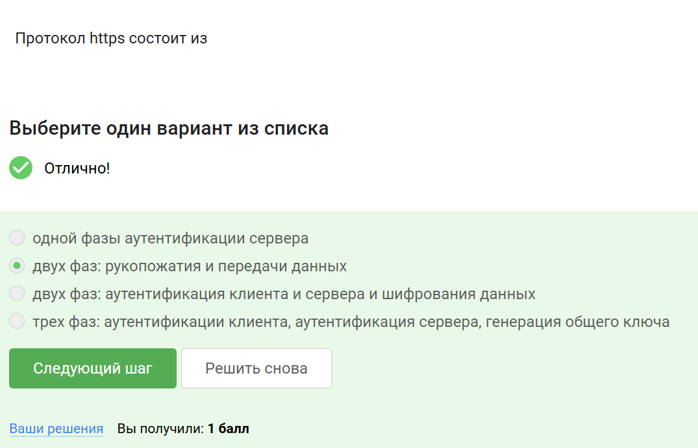{#fig:001 width=70%}

##

Это происходит с обеих сторон

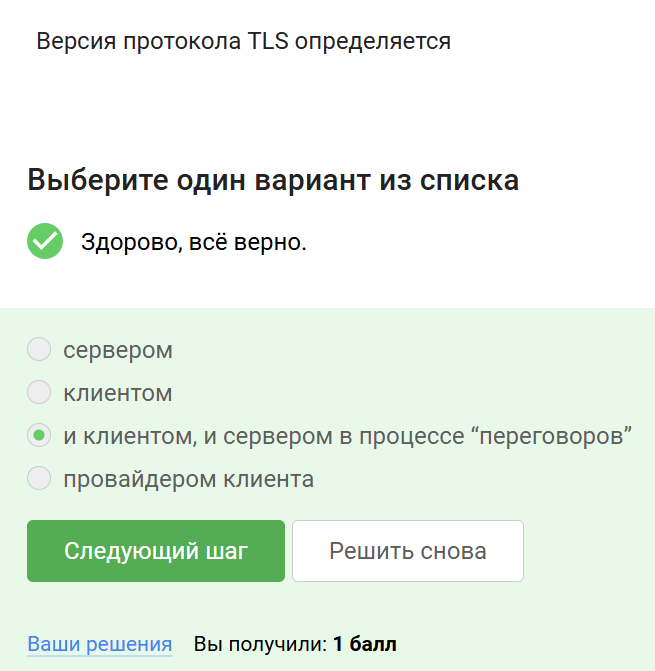{#fig:001 width=70%}

##

Этот протокол в фазе рукопожатия не предусматривает шифрование данных

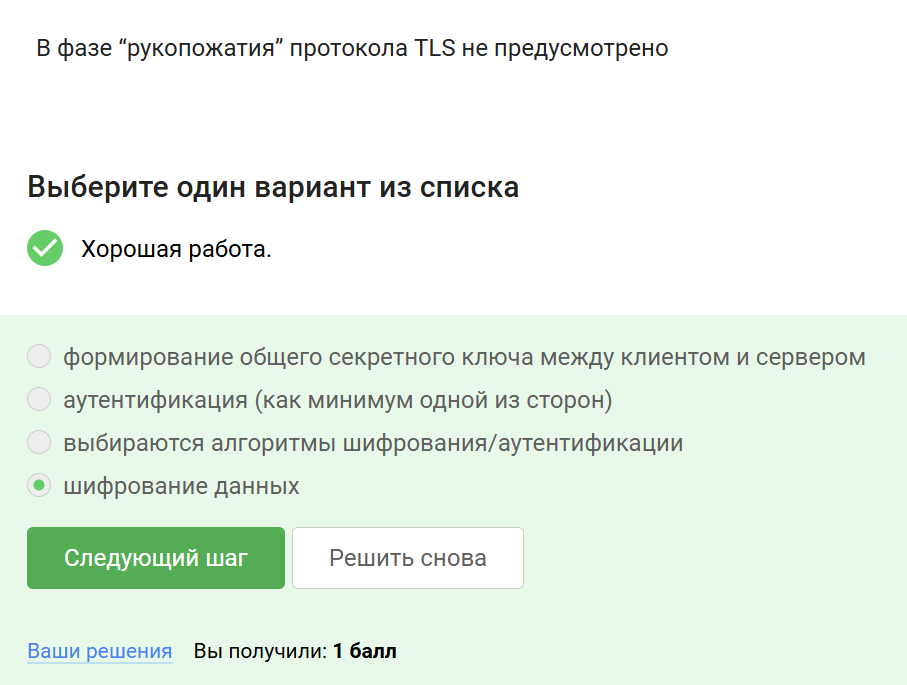{#fig:001 width=70%}

##

Выбираю, что хранят куки

{#fig:001 width=70%}

##

Куки никак не связаны с улучшением надежности соединения

{#fig:001 width=70%}

##

Клиент не занимается генерацией куки, это делает сервер

{#fig:001 width=70%}

##

Выбираю правильный ответ

{#fig:001 width=70%}

##

В этой луковой сети 3 промежуточных узла

{#fig:001 width=70%}

##

IP-адрес получателя известен отправителю и выходному узлу

{#fig:001 width=70%}

##

Выбираю правильный ответ

{#fig:001 width=70%}

##

Для этого подходит любой браузер, поэтому нет

{#fig:001 width=70%}

##

Это определение Wi-Fi

{#fig:001 width=70%}

##

Это тоже факт

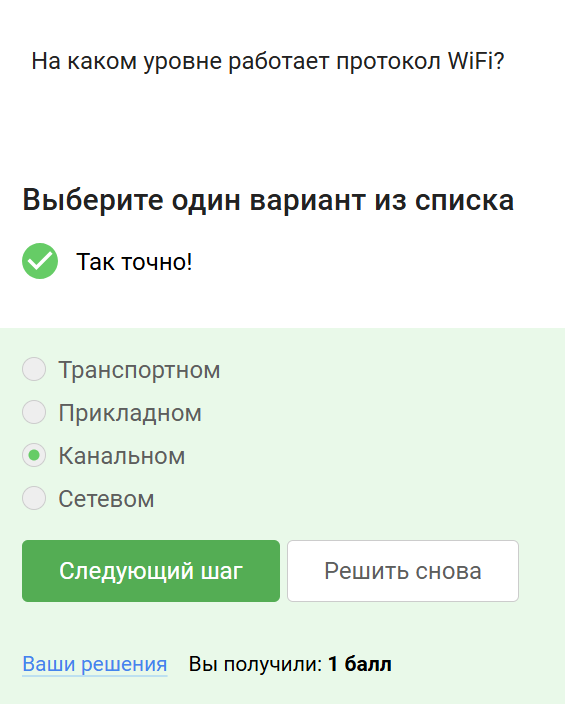{#fig:001 width=70%}

##

Выбираю небезопасный метод

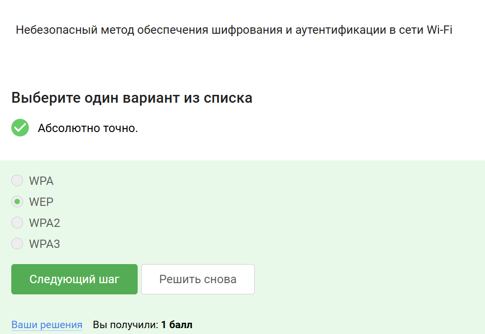{#fig:001 width=70%}

##

Это делается для безопасности

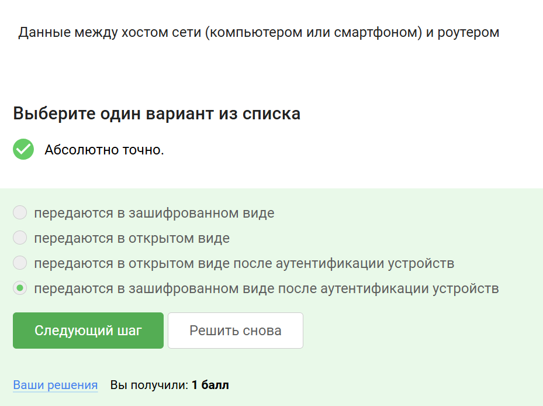{#fig:001 width=70%}

##

Выбирают метод

{#fig:001 width=70%}

##

## Этап 2

##

Это правда

{#fig:001 width=70%}

##

Шифрование диска основано на симметричном шифровании

{#fig:001 width=70%}

##

Выбираю программы для зашифровки жесткого диска

{#fig:001 width=70%}

##

Этот пароль можно отнести к стойким, так как он содержит и строчные, и заглавные буквы, цифры, специальные знаки

{#fig:001 width=70%}

##

Менеджер паролей специально предназначен для безопасного хранения паролей

{#fig:001 width=70%}

##

Выбираю предназначение капчи

{#fig:001 width=70%}

##

Хэширование нужно, чтобы не хранить пароли на сервере в открытом виде

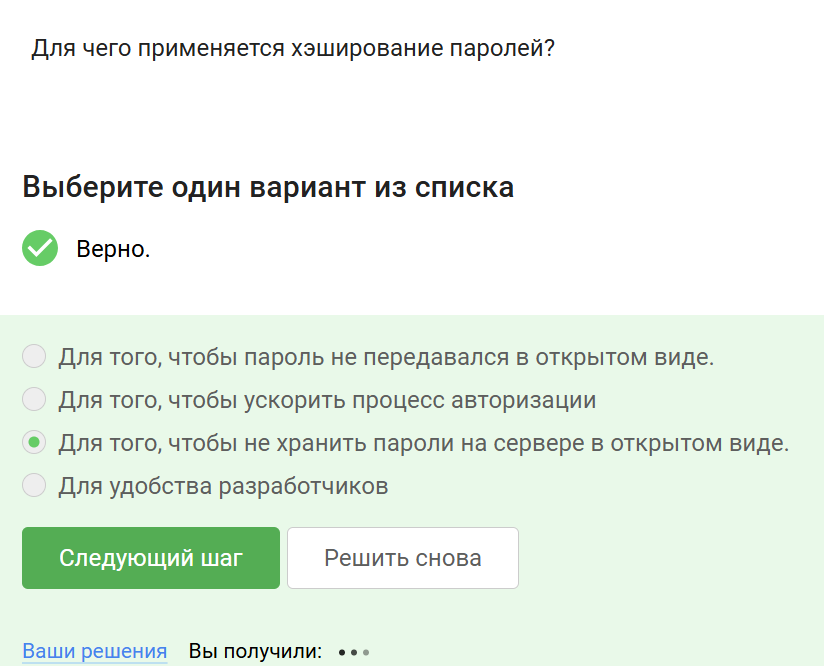{#fig:001 width=70%}

##

Это правда

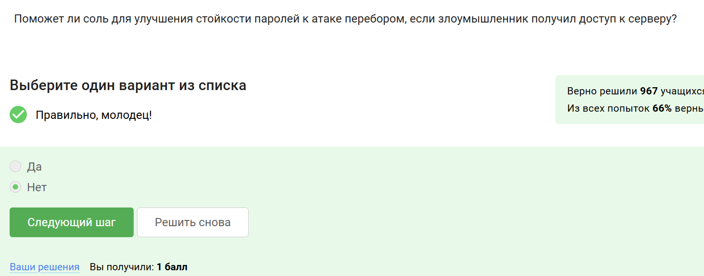{#fig:001 width=70%}

##

Выбираю все, так как все представленные меры защищают от утечек данных атакой перебором

{#fig:001 width=70%}

##

Смотрю ссылки реальные и сравниваю с представленными

{#fig:001 width=70%}

##

Может. Человека могли взломать, он мог ошибиться

{#fig:001 width=70%}

##

Это определение

{#fig:001 width=70%}

##

Это определение

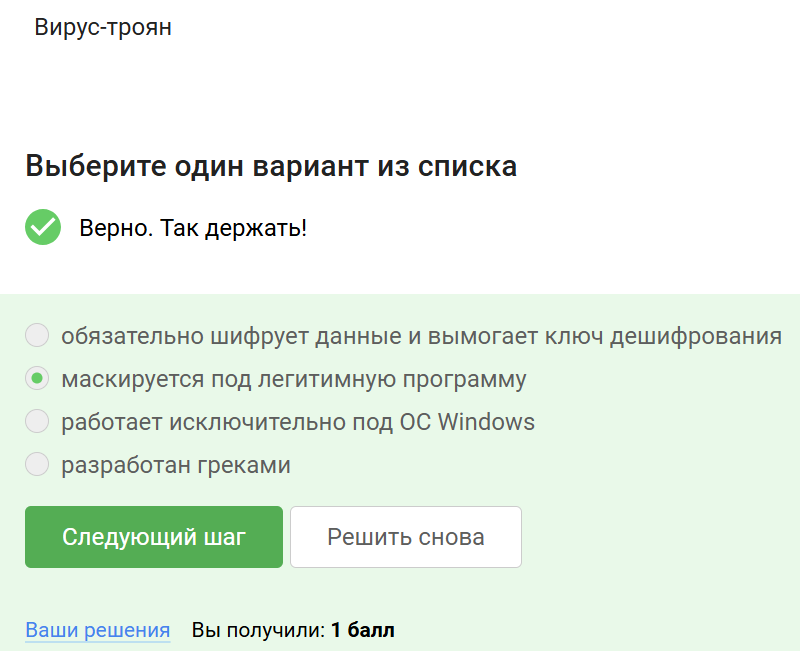{#fig:001 width=70%}

##

Это факт

{#fig:001 width=70%}

##

Выбираю суть сквозного шифрования

{#fig:001 width=70%}

##

## Этап 3

##

Это факт

{#fig:001 width=70%}

##

Из всего эта хэш-функция только не обеспечивает конфиденциальность захэшированных данных

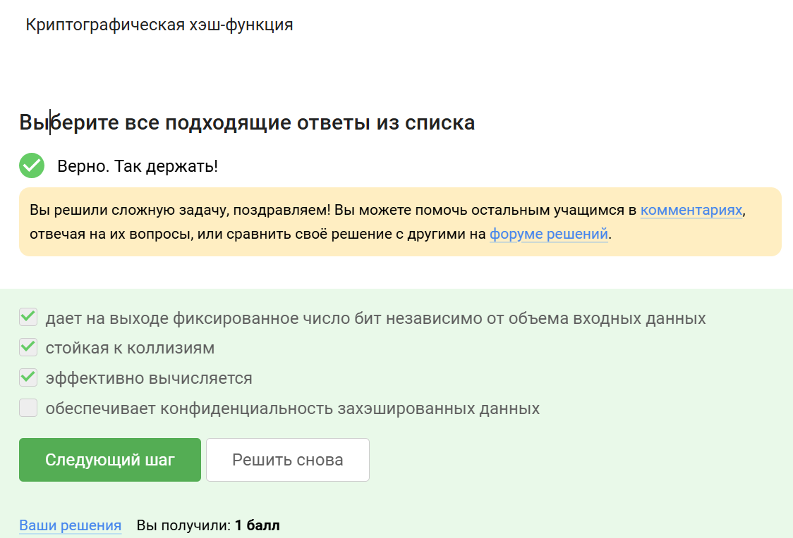{#fig:001 width=70%}

##

Первые 2 не относятся

{#fig:001 width=70%}

##

Это факт

{#fig:001 width=70%}

##

Это определение

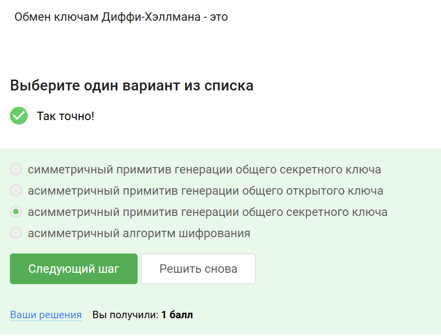{#fig:001 width=70%}

##

Это факт

{#fig:001 width=70%}

##

Это было сказано в видео

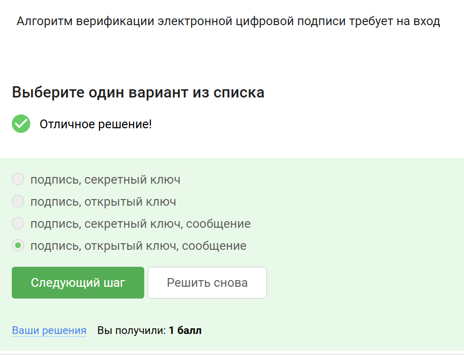{#fig:001 width=70%}

##

Правда, ключ открытый, например

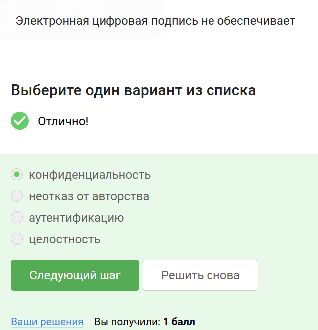{#fig:001 width=70%}

##

Это требование

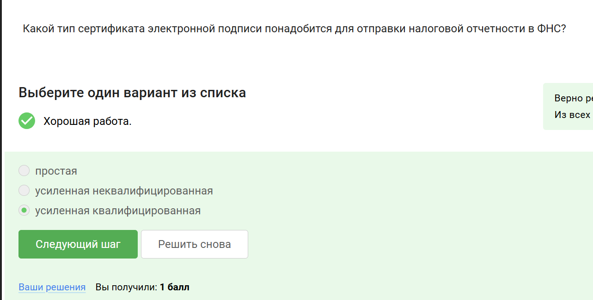{#fig:001 width=70%}

##

Это специализированный центр

{#fig:001 width=70%}

##

Все остальное - криптовалюта, методы снятия или пополнения денег со счёта и так далее

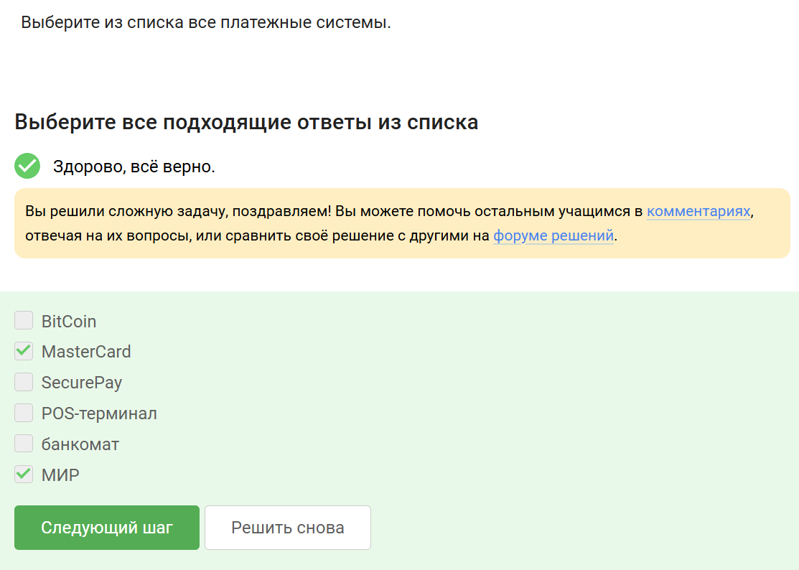{#fig:001 width=70%}

##

Все остальное не является

{#fig:001 width=70%}

##

Для защиты используется то, что я выбрала

{#fig:001 width=70%}

##

Это факт

{#fig:001 width=70%}

##

Всё выбранные свойства нам подходят

{#fig:001 width=70%}

##

Цифровая подпись, которой и был посвящен этот раздел

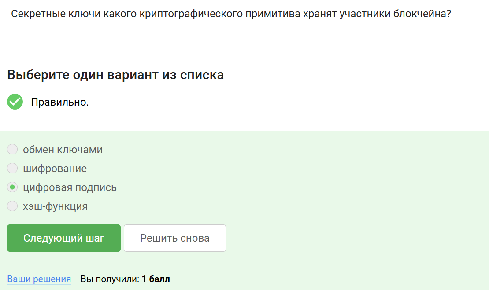{#fig:001 width=70%}
