---
## Front matter
lang: ru-RU
title: Презентация по лабораторной работе №2
subtitle: Информационная безопасность
author:
  - Арбатова В. П.
institute:
  - Российский университет дружбы народов, Москва, Россия
date: 03 марта 2025

## i18n babel
babel-lang: russian
babel-otherlangs: english

## Formatting pdf
toc: false
toc-title: Содержание
slide_level: 2
aspectratio: 169
section-titles: true
theme: metropolis
header-includes:
 - \metroset{progressbar=frametitle,sectionpage=progressbar,numbering=fraction}
---

# Цель работы

Получение практических навыков работы в консоли с атрибутами файлов, закрепление теоретических основ дискреционного разграничения доступа в современных системах с открытым кодом на базе ОС Linux

# Задание

1. Работа с атрибутами файлов
2. Заполнение таблицы "Установленные права и разрешённые действия" (см. табл. 2.1)
3. Заполнение таблицы "Минимальные права для совершения операций" (см. табл. 2.2)

# Выполнение лабораторной работы

## 

Создаю учётную запись пользователя

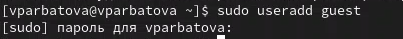{#fig:001 width=70%}

## 

Создаю пароль для пользователя guest

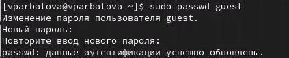{#fig:001 width=70%}

##

Вхожу в систему от имени нового пользователя

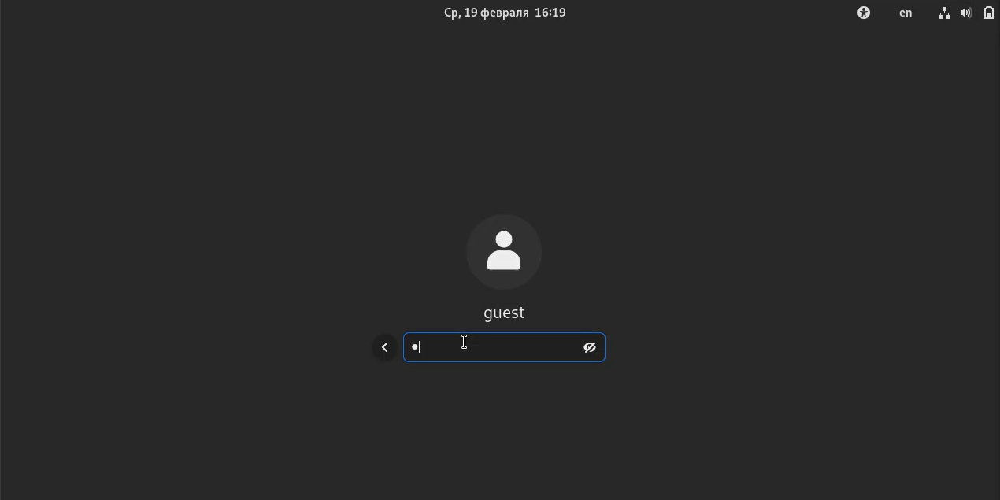{#fig:001 width=70%}

## 

Определяю директорию, в которой нахожусь, затем пишу вторую команду, чтобы переместиться в домашнюю директорию и проверяю вывод функции. Он совпадает с первым

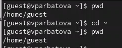{#fig:001 width=70%}

## 

Уточняю имя пользователя

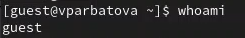{#fig:001 width=70%}

## 

Смотрю имя пользователя и его группы командой id, сравниваю с результатом команды groups. Они совпадают. С данными, выводимыми в приглашении командной строки совпадают тоже

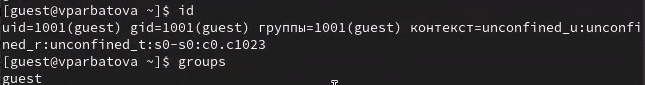{#fig:001 width=70%}

##

С помощью дополнения в виде команды grep guest к команде из задания фильтрую результаты поиска. Все результаты совпадают с предыдущими

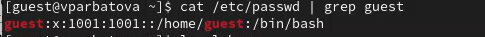{#fig:001 width=70%}

## 

Определяю существующие в системе директории командой ls-l /home/. Удалось получить список поддиректорий директории /home?. На них установлены права rwx------

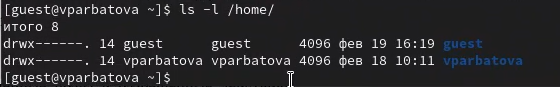{#fig:001 width=70%}

## 

Проверяю, какие расширенные атрибуты установлены на поддиректориях, находящихся в директории /home, командой:
 lsattr /home. Расширенные атрибуты посмотреть не удалось, директории других пользователей тоже

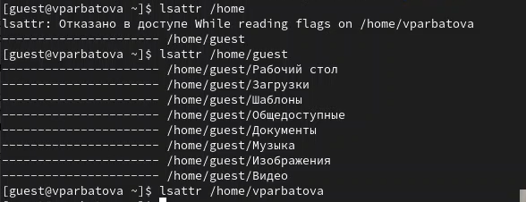{#fig:001 width=70%}

## 

Создаю директорию, определяю права

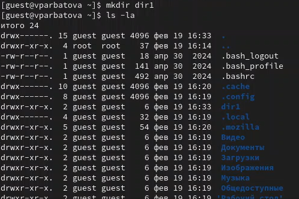{#fig:001 width=70%}

## 

Снимаю все атрибуты с этой директории, проверяю, получилось ли

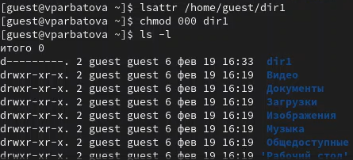{#fig:001 width=70%}

## 

Попытаюсь создать в директории dir1 файл file1 командой
 echo "test" > /home/guest/dir1/file1
Это не получается из=за отсутствия у меня прав на редактирование директории.
Файл просто не создался

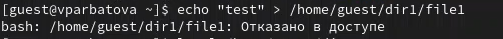{#fig:001 width=70%}

# Выводы

Получила практические навыки работы в консоли с атрибутами файлов, закрепила теоретические основы дискреционного разграничения доступа в современных системах с открытым кодом на базе ОС Linux

# Список литературы{.unnumbered}

::: {#refs}
:::

