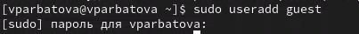
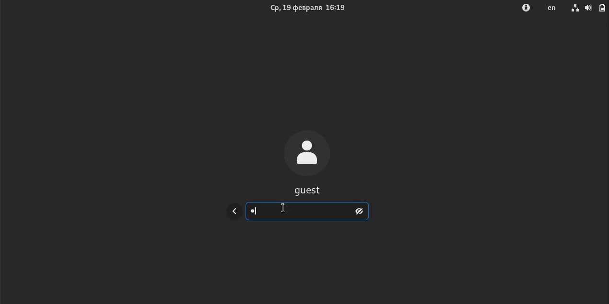
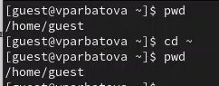
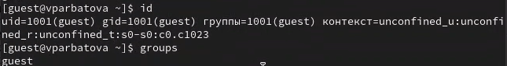
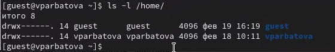
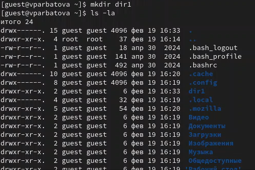
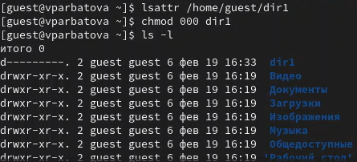

---
## Front matter
title: "Шаблон отчёта по лабораторной работе"
subtitle: "Простейший вариант"
author: "Дмитрий Сергеевич Кулябов"

## Generic otions
lang: ru-RU
toc-title: "Содержание"

## Bibliography
bibliography: bib/cite.bib
csl: pandoc/csl/gost-r-7-0-5-2008-numeric.csl

## Pdf output format
toc: true # Table of contents
toc-depth: 2
lof: true # List of figures
lot: true # List of tables
fontsize: 12pt
linestretch: 1.5
papersize: a4
documentclass: scrreprt
## I18n polyglossia
polyglossia-lang:
  name: russian
  options:
	- spelling=modern
	- babelshorthands=true
polyglossia-otherlangs:
  name: english
## I18n babel
babel-lang: russian
babel-otherlangs: english
## Fonts
mainfont: IBM Plex Serif
romanfont: IBM Plex Serif
sansfont: IBM Plex Sans
monofont: IBM Plex Mono
mathfont: STIX Two Math
mainfontoptions: Ligatures=Common,Ligatures=TeX,Scale=0.94
romanfontoptions: Ligatures=Common,Ligatures=TeX,Scale=0.94
sansfontoptions: Ligatures=Common,Ligatures=TeX,Scale=MatchLowercase,Scale=0.94
monofontoptions: Scale=MatchLowercase,Scale=0.94,FakeStretch=0.9
mathfontoptions:
## Biblatex
biblatex: true
biblio-style: "gost-numeric"
biblatexoptions:
  - parentracker=true
  - backend=biber
  - hyperref=auto
  - language=auto
  - autolang=other*
  - citestyle=gost-numeric
## Pandoc-crossref LaTeX customization
figureTitle: "Рис."
tableTitle: "Таблица"
listingTitle: "Листинг"
lofTitle: "Список иллюстраций"
lotTitle: "Список таблиц"
lolTitle: "Листинги"
## Misc options
indent: true
header-includes:
  - \usepackage{indentfirst}
  - \usepackage{float} # keep figures where there are in the text
  - \floatplacement{figure}{H} # keep figures where there are in the text
---

# Цель работы

Получение практических навыков работы в консоли с атрибутами файлов, закрепление теоретических основ дискреционного разграничения доступа в современных системах с открытым кодом на базе ОС Linux

# Задание

1. Работа с атрибутами файлов
2. Заполнение таблицы "Установленные права и разрешённые действия" (см. табл. 2.1)
3. Заполнение таблицы "Минимальные права для совершения операций" (см. табл. 2.2)

# Выполнение лабораторной работы

Создаю учётную запись пользователя

{#fig:001 width=70%}

Создаю пароль для пользователя guest

{#fig:001 width=70%}

Вхожу в систему от имени нового пользователя

{#fig:001 width=70%}

Определяю директорию, в которой нахожусь, затем пишу вторую команду, чтобы переместиться в домашнюю директорию и проверяю вывод функции. Он совпадает с первым

{#fig:001 width=70%}

Уточняю имя пользователя

{#fig:001 width=70%}

Смотрю имя пользователя и его группы командой id, сравниваю с результатом команды groups. Они совпадают. С данными, выводимыми в приглашении командной строки совпадают тоже

{#fig:001 width=70%}

С помощью дополнения в виде команды grep guest к команде из задания фильтрую результаты поиска. Все результаты совпадают с предыдущими

{#fig:001 width=70%}

Определяю существующие в системе директории командой ls-l /home/. Удалось получить список поддиректорий директории /home?. На них установлены права rwx------

{#fig:001 width=70%}

Проверяю, какие расширенные атрибуты установлены на поддиректориях, находящихся в директории /home, командой:
 lsattr /home. Расширенные атрибуты посмотреть не удалось, директории других пользователей тоже

{#fig:001 width=70%}

Создаю директорию,, определяю права

{#fig:001 width=70%}

Снимаю все атрибуты с этой директории, проверяю, получилось ли

{#fig:001 width=70%}

Попытаюсь создать в директории dir1 файл file1 командой
 echo "test" > /home/guest/dir1/file1
Это не получается из=за отсутствия у меня прав на редактирование директории.
Файл просто не создался

{#fig:001 width=70%}

# Выводы

Получила практические навыки работы в консоли с атрибутами файлов, закрепила теоретические основы дискреционного разграничения доступа в современных системах с открытым кодом на базе ОС Linux

# Список литературы{.unnumbered}

::: {#refs}
:::
