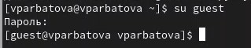
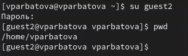
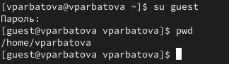
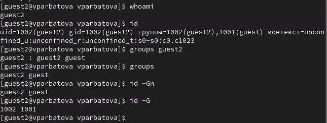
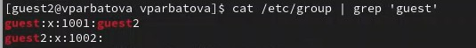

---
## Front matter
lang: ru-RU
title: Презентация по лабораторной работе №3
subtitle: Информационная безопасность
author:
  - Арбатова В. П. 
institute:
  - Российский университет дружбы народов, Москва, Россия
date: 20 марта 2025

## i18n babel
babel-lang: russian
babel-otherlangs: english

## Formatting pdf
toc: false
toc-title: Содержание
slide_level: 2
aspectratio: 169
section-titles: true
theme: metropolis
header-includes:
 - \metroset{progressbar=frametitle,sectionpage=progressbar,numbering=fraction}
---

# Цель работы

Получить практические навыки работы в консоли с атрибутами файлов для групп пользователей

# Задание

Создание пользователя guest2, добавление его в группу пользователей guest
Заполнение таблицы 3.1
Заполнение таблицы 3.2 на основе таблицы 3.1.
(Таблица лежи в файле на github)

# Теоретическое введение

Права доступа определяют, какие действия конкретный пользователь может или не может совершать с определенным файлами и каталогами. С помощью разрешений можно создать надежную среду — такую, в которой никто не может поменять содержимое ваших документов или повредить системные файлы. [1]

Группы пользователей Linux кроме стандартных root и users, здесь есть еще пару десятков групп. Это группы, созданные программами, для управления доступом этих программ к общим ресурсам. Каждая группа разрешает чтение или запись определенного файла или каталога системы, тем самым регулируя полномочия пользователя, а следовательно, и процесса, запущенного от этого пользователя. Здесь можно считать, что пользователь - это одно и то же что процесс, потому что у процесса все полномочия пользователя, от которого он запущен. [2]

daemon - от имени этой группы и пользователя daemon запускаютcя сервисы, которым необходима возможность записи файлов на диск.
sys - группа открывает доступ к исходникам ядра и файлам - include сохраненным в системе
sync - позволяет выполнять команду /bin/sync
games - разрешает играм записывать свои файлы настроек и историю в определенную папку
man - позволяет добавлять страницы в директорию /var/cache/man
lp - позволяет использовать устройства параллельных портов
mail - позволяет записывать данные в почтовые ящики /var/mail/
proxy - используется прокси серверами, нет доступа записи файлов на диск
www-data - с этой группой запускается веб-сервер, она дает доступ на запись /var/www, где находятся файлы веб-документов
list - позволяет просматривать сообщения в /var/mail
nogroup - используется для процессов, которые не могут создавать файлов на жестком диске, а только читать, обычно применяется вместе с пользователем nobody.
adm - позволяет читать логи из директории /var/log
tty - все устройства /dev/vca разрешают доступ на чтение и запись пользователям из этой группы
disk - открывает доступ к жестким дискам /dev/sd* /dev/hd*, можно сказать, что это аналог рут доступа.
dialout - полный доступ к серийному порту
cdrom - доступ к CD-ROM
wheel - позволяет запускать утилиту sudo для повышения привилегий
audio - управление аудиодрайвером
src - полный доступ к исходникам в каталоге /usr/src/
shadow - разрешает чтение файла /etc/shadow
utmp - разрешает запись в файлы /var/log/utmp /var/log/wtmp
video - позволяет работать с видеодрайвером
plugdev - позволяет монтировать внешние устройства USB, CD и т д
staff - разрешает запись в папку /usr/local

# Выполнение лабораторной работы

##

Так как пользователь guest был создан в лабораторной работе № 2, создаю только пользователя guest2, задаю для него пароль, добавляю этого пользователя в группу guest

{#fig:001 width=70%}

##

Захожу с помощью команды su в аккаунт guest

{#fig:001 width=70%}

##

Во второй консоли захожу в аккаунт guest2 и узнаю директорию, в которой нахожусь. Стоит отметить, что вход в терминал от имени пользователей был выполнен в домашней директории пользователя vparbatova, которую команда pwd вывела. Домашней директорией пользователей она не является. Текущая директория с приглашением командной строки совпадает.

{#fig:001 width=70%}

##

Аналогично узнаю для guest 

{#fig:001 width=70%}

##

Проверяю имя пользователей с помощью команды whoami, с помощью команды id могу увидеть группы, к которым принадлежит пользователь и коды этих групп (gid), команда groups просто выведет список групп, в которые входит пользователь.
id -Gn - выведет названия групп, которым принадлежит пользователь

id -G - выведет только код групп, которым принадлежит пользователь.

Проверка для пользователя guest

{#fig:001 width=70%}

##

Проверка для пользователя guest2

{#fig:001 width=70%}

##

Вывела интересующее меня содержимое файла etc/group, видно, что в группе guest два пользователя, а в группе guest2 один

{#fig:001 width=70%}

##

От имени пользователя guest2 регистрирую его в группе guest с помощью команды newgrp

{#fig:001 width=70%}

##

Добавляю права на чтение, запись и исполнение группе пользвателей guest (guest, guest2) на директорию home/guest в которой находятся все файлы для последующей работы

{#fig:001 width=70%}

##

От имени пользователя guest снимаю все атрибуты с директории dir1, созданной в предыдущей лабораторной работе. Проверяю, что права действительно сняты

{#fig:001 width=70%}

# Выводы

Я получила практические навыки работы в консоли с атрибутами файлов для групп пользователей

# Список литературы{.unnumbered}

::: {#refs}
:::
