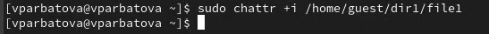
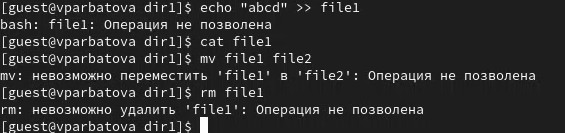

---
## Front matter
title: "Отчёта по лабораторной работе № 4"
subtitle: "Информационная безопасность"
author: "Арбатова Варвара Петровна"

## Generic otions
lang: ru-RU
toc-title: "Содержание"

## Bibliography
bibliography: bib/cite.bib
csl: pandoc/csl/gost-r-7-0-5-2008-numeric.csl

## Pdf output format
toc: true # Table of contents
toc-depth: 2
lof: true # List of figures
lot: true # List of tables
fontsize: 12pt
linestretch: 1.5
papersize: a4
documentclass: scrreprt
## I18n polyglossia
polyglossia-lang:
  name: russian
  options:
	- spelling=modern
	- babelshorthands=true
polyglossia-otherlangs:
  name: english
## I18n babel
babel-lang: russian
babel-otherlangs: english
## Fonts
mainfont: IBM Plex Serif
romanfont: IBM Plex Serif
sansfont: IBM Plex Sans
monofont: IBM Plex Mono
mathfont: STIX Two Math
mainfontoptions: Ligatures=Common,Ligatures=TeX,Scale=0.94
romanfontoptions: Ligatures=Common,Ligatures=TeX,Scale=0.94
sansfontoptions: Ligatures=Common,Ligatures=TeX,Scale=MatchLowercase,Scale=0.94
monofontoptions: Scale=MatchLowercase,Scale=0.94,FakeStretch=0.9
mathfontoptions:
## Biblatex
biblatex: true
biblio-style: "gost-numeric"
biblatexoptions:
  - parentracker=true
  - backend=biber
  - hyperref=auto
  - language=auto
  - autolang=other*
  - citestyle=gost-numeric
## Pandoc-crossref LaTeX customization
figureTitle: "Рис."
tableTitle: "Таблица"
listingTitle: "Листинг"
lofTitle: "Список иллюстраций"
lotTitle: "Список таблиц"
lolTitle: "Листинги"
## Misc options
indent: true
header-includes:
  - \usepackage{indentfirst}
  - \usepackage{float} # keep figures where there are in the text
  - \floatplacement{figure}{H} # keep figures where there are in the text
---

# Цель работы

Получение практических навыков работы в консоли с расширенными атрибутами файлов

# Теоретическое введение

Права доступа определяют, какие действия конкретный пользователь может или не может совершать с определенным файлами и каталогами. С помощью разрешений можно создать надежную среду — такую, в которой никто не может поменять содержимое ваших документов или повредить системные файлы. [1]

Расширенные атрибуты файлов Linux представляют собой пары имя:значение, которые постоянно связаны с файлами и каталогами, подобно тому как строки окружения связаны с процессом. Атрибут может быть определён или не определён. Если он определён, то его значение может быть или пустым, или не пустым. [2]

Расширенные атрибуты дополняют обычные атрибуты, которые связаны со всеми inode в файловой системе (т. е., данные stat(2)). Часто они используются для предоставления дополнительных возможностей файловой системы, например, дополнительные возможности безопасности, такие как списки контроля доступа (ACL), могут быть реализованы через расширенные атрибуты. [3]

Установить атрибуты:

chattr filename
Значения:

chattr +a # только добавление. Удаление и переименование запрещено;

chattr +A # не фиксировать данные об обращении к файлу

chattr +c # сжатый файл

chattr +d # неархивируемый файл

chattr +i # неизменяемый файл

chattr +S # синхронное обновление

chattr +s # безопасное удаление, (после удаления место на диске переписывается нулями)

chattr +u # неудаляемый файл

chattr -R # рекурсия

Просмотреть атрибуты:

lsattr filename
Опции:

lsattr -R # рекурсия

lsattr -a # вывести все файлы (включая скрытые)

lsattr -d # не выводить содержимое директории

# Выполнение лабораторной работы

С помощью команды su захожу от имени пользователя guest не выходя из основного. От имени пользователя guest, созданного в прошлых лабораторных работах, определяю расширенные атрибуты файлa

{#fig:001 width=70%}

Изменяю права доступа. Пробую установить на файл /home/guest/dir1/file1 расширенный атрибут a от имени пользователя guest, в ответ получаю отказ от выполнения операции

{#fig:001 width=70%}

От имени суперпользователя устанавливаю расширенный атрибут а

{#fig:001 width=70%}

Проверяю, атрибут действительно установлен. Записываю данные в файл и проверяю, всё успешно

{#fig:001 width=70%}

Пробую удалить, записать данные и переименовать файл. Везде отказано в доступе

{#fig:001 width=70%}

Убираю все права

{#fig:001 width=70%}

От имени суперпользователя убираю расширенный атрибут а

{#fig:001 width=70%}

Провожу операции, всё работает

{#fig:001 width=70%}

От имени суперпользователя устанавливаю расширенный атрибут i

{#fig:001 width=70%}

Снова пробую проводить манипуляции. Ничего не получается

{#fig:001 width=70%}

# Выводы

Я получила практические навыки работы в консоли с расширенными атрибутами файлов

# Список литературы{.unnumbered}

::: {#refs}
:::
