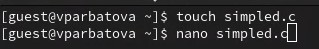
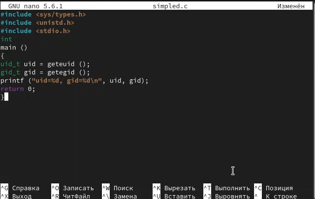
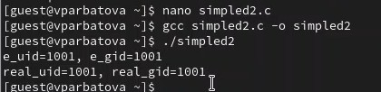
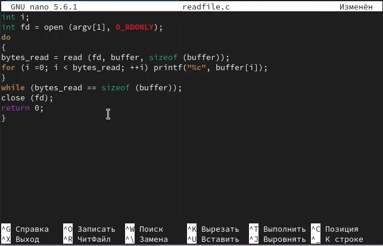
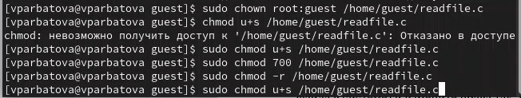
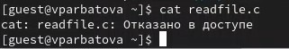
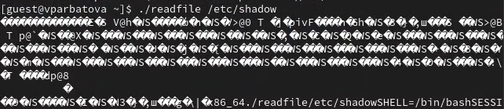
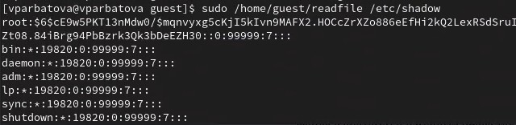
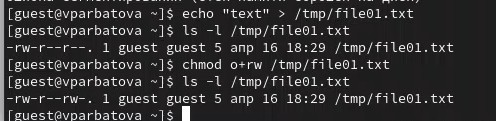
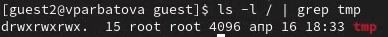

---
## Front matter
lang: ru-RU
title: Презентация по лабораторной работе № 5
subtitle: Информационная безопасность
author:
  - Арбатова В. П.
institute:
  - Российский университет дружбы народов, Москва, Россия
date: 17 апреля 2025

## i18n babel
babel-lang: russian
babel-otherlangs: english

## Formatting pdf
toc: false
toc-title: Содержание
slide_level: 2
aspectratio: 169
section-titles: true
theme: metropolis
header-includes:
 - \metroset{progressbar=frametitle,sectionpage=progressbar,numbering=fraction}
---

# Цель работы

Изучение механизмов изменения идентификаторов, применения SetUID- и Sticky-битов. Получение практических навыков работы в кон- соли с дополнительными атрибутами. Рассмотрение работы механизма смены идентификатора процессов пользователей, а также влияние бита Sticky на запись и удаление файлов.

# Теоретическое введение

Дополнительные атрибуты файлов Linux
В Linux существует три основных вида прав — право на чтение (read), запись (write) и выполнение (execute), а также три категории пользователей, к которым они могут применяться — владелец файла (user), группа владельца (group) и все остальные (others). Но, кроме прав чтения, выполнения и записи, есть еще три дополнительных атрибута. [@u]

Sticky bit

Используется в основном для каталогов, чтобы защитить в них файлы. В такой каталог может писать любой пользователь. Но, из такой директории пользователь может удалить только те файлы, владельцем которых он является. Примером может служить директория /tmp, в которой запись открыта для всех пользователей, но нежелательно удаление чужих файлов.

SUID (Set User ID)

Атрибут исполняемого файла, позволяющий запустить его с правами владельца. В Linux приложение запускается с правами пользователя, запустившего указанное приложение. Это обеспечивает дополнительную безопасность т.к. процесс с правами пользователя не сможет получить доступ к важным системным файлам, которые принадлежат пользователю root.

SGID (Set Group ID)

Аналогичен suid, но относиться к группе. Если установить sgid для каталога, то все файлы созданные в нем, при запуске будут принимать идентификатор группы каталога, а не группы владельца, который создал файл в этом каталоге.

Обозначение атрибутов sticky, suid, sgid

Специальные права используются довольно редко, поэтому при выводе программы ls -l символ, обозначающий указанные атрибуты, закрывает символ стандартных прав доступа.

Пример: rwsrwsrwt

где первая s — это suid, вторая s — это sgid, а последняя t — это sticky bit

В приведенном примере не понятно, rwt — это rw- или rwx? Определить это просто. Если t маленькое, значит x установлен. Если T большое, значит x не установлен. То же самое правило распространяется и на s.

В числовом эквиваленте данные атрибуты определяются первым символом при четырехзначном обозначении (который часто опускается при назначении прав), например в правах 1777 — символ 1 обозначает sticky bit. Остальные атрибуты имеют следующие числовое соответствие:

1 — установлен sticky bit
2 — установлен sgid
4 — установлен suid
Компилятор GCC
GСС - это свободно доступный оптимизирующий компилятор для языков C, C++. Собственно программа gcc это некоторая надстройка над группой компиляторов, которая способна анализировать имена файлов, передаваемые ей в качестве аргументов, и определять, какие действия необходимо выполнить. Файлы с расширением .cc или .C рассматриваются, как файлы на языке C++, файлы с расширением .c как программы на языке C, а файлы c расширением .o считаются объектными [@gcc].

# Выполнение лабораторной работы

##

Для лабораторной работы необходимо проверить, установлен ли компилятор gcc, комнда gcc -v позволяет это сделать. Также осуществляется отключение системы запретом с помощью setenforce 0

{#fig:001 width=70%}

##

Создаю файл и открываю его в редакторе nano

{#fig:001 width=70%}

##

Текст файла

{#fig:001 width=70%}

##

Компилирую файл, проверяю, запускаю, узнаю id

{#fig:001 width=70%}

##

Текст второго файла

{#fig:001 width=70%}

##

Повторяю операции со вторым файлом

{#fig:001 width=70%}

##

С помощью chown изменяю владельца файла на суперпользователя, с помощью chmod изменяю права доступа

{#fig:001 width=70%}

##

Сравниваю выводы, моя команда вывела меньше информации

{#fig:001 width=70%}

##

Текст файла

{#fig:001 width=70%}

##

Создаю файл, открываю его в редакторе, компилирую, проверяю

{#fig:001 width=70%}

##

Продолжаю изменять права от имени суперпользователя

{#fig:001 width=70%}

##

Пытаюсь от имени пользователя guest прочитать файл, не получается

{#fig:001 width=70%}

##

Пытаюсь прочесть файл с помощью нашего файла, получаю отказ в доступе

{#fig:001 width=70%}

##

Пытаюсь прочесть другой файл

{#fig:001 width=70%}

##

Пробуем прочесть эти же файлы от имени суперпользователя и чтение файлов проходит успешно

{#fig:001 width=70%}

##

Проверяем папку tmp на наличие атрибута Sticky, т.к. в выводе есть буква t, то атрибут установлен

{#fig:001 width=70%}

##

От имени пользователя guest создаю файл с текстом, добавляю права на чтение и запись для других пользователей

{#fig:001 width=70%}

##

Вхожу в систему от имени пользователя guest2, от его имени могу прочитать файл file01.txt, но перезаписать информацию в нем не могу 
Также невозможно добавить в файл file01.txt новую информацию от имени пользователя guest2
Далее пробуем удалить файл, снова получаем отказ

{#fig:001 width=70%}

##

От имени суперпользователя снимаем с директории атрибут Sticky

{#fig:001 width=70%}

##

Проверяем, что атрибут действительно снят

{#fig:001 width=70%}

##

Далее был выполнен повтор предыдущих действий. По результатам без Sticky-бита запись в файл и дозапись в файл осталась невозможной, зато удаление файла прошло успешно

{#fig:001 width=70%}

##

# Выводы

Изучила механизм изменения идентификаторов, применила SetUID- и Sticky-биты. Получила практические навыки работы в кон- соли с дополнительными атрибутами. Рассмотрела работы механизма смены идентификатора процессов пользователей, а также влияние бита Sticky на запись и удаление файлов.

# Список литературы{.unnumbered}

::: {#refs}
:::
