---
## Front matter
title: "Отчёт по лабораторной работе №6"
subtitle: "Информационная безопасность"
author: "Арбатова Варвара Петровна"

## Generic otions
lang: ru-RU
toc-title: "Содержание"

## Bibliography
bibliography: bib/cite.bib
csl: pandoc/csl/gost-r-7-0-5-2008-numeric.csl

## Pdf output format
toc: true # Table of contents
toc-depth: 2
lof: true # List of figures
lot: true # List of tables
fontsize: 12pt
linestretch: 1.5
papersize: a4
documentclass: scrreprt
## I18n polyglossia
polyglossia-lang:
  name: russian
  options:
	- spelling=modern
	- babelshorthands=true
polyglossia-otherlangs:
  name: english
## I18n babel
babel-lang: russian
babel-otherlangs: english
## Fonts
mainfont: IBM Plex Serif
romanfont: IBM Plex Serif
sansfont: IBM Plex Sans
monofont: IBM Plex Mono
mathfont: STIX Two Math
mainfontoptions: Ligatures=Common,Ligatures=TeX,Scale=0.94
romanfontoptions: Ligatures=Common,Ligatures=TeX,Scale=0.94
sansfontoptions: Ligatures=Common,Ligatures=TeX,Scale=MatchLowercase,Scale=0.94
monofontoptions: Scale=MatchLowercase,Scale=0.94,FakeStretch=0.9
mathfontoptions:
## Biblatex
biblatex: true
biblio-style: "gost-numeric"
biblatexoptions:
  - parentracker=true
  - backend=biber
  - hyperref=auto
  - language=auto
  - autolang=other*
  - citestyle=gost-numeric
## Pandoc-crossref LaTeX customization
figureTitle: "Рис."
tableTitle: "Таблица"
listingTitle: "Листинг"
lofTitle: "Список иллюстраций"
lotTitle: "Список таблиц"
lolTitle: "Листинги"
## Misc options
indent: true
header-includes:
  - \usepackage{indentfirst}
  - \usepackage{float} # keep figures where there are in the text
  - \floatplacement{figure}{H} # keep figures where there are in the text
---

# Цель работы

Развить навыки администрирования ОС Linux. Получить первое практическое знакомство с технологией SELinux1. Проверить работу SELinx на практике совместно с веб-сервером Apache. [@course]

# Теоретическое введение

SELinux (Security-Enhanced Linux) обеспечивает усиление защиты путем внесения изменений как на уровне ядра, так и на уровне пространства пользователя, что превращает ее в действительно «непробиваемую» операционную систему. Впервые эта система появилась в четвертой версии CentOS, а в 5 и 6 версии реализация была существенно дополнена и улучшена.
SELinux имеет три основных режим работы:

Enforcing: режим по умолчанию. При выборе этого режима все действия, которые каким-то образом нарушают текущую политику безопасности, будут блокироваться, а попытка нарушения будет зафиксирована в журнале.

Permissive: в случае использования этого режима, информация о всех действиях, которые нарушают текущую политику безопасности, будут зафиксированы в журнале, но сами действия не будут заблокированы.

Disabled: полное отключение системы принудительного контроля доступа.

Политика SELinux определяет доступ пользователей к ролям, доступ ролей к доменам и доступ доменов к типам. Контекст безопасности — все атрибуты SELinux — роли, типы и домены. Более подробно см. в [@f].

Apache — это свободное программное обеспечение, с помощью которого можно создать веб-сервер. Данный продукт возник как доработанная версия другого HTTP-клиента от национального центра суперкомпьютерных приложений (NCSA).
Для чего нужен Apache сервер:

чтобы открывать динамические PHP-страницы,

для распределения поступающей на сервер нагрузки,

для обеспечения отказоустойчивости сервера,

чтобы потренироваться в настройке сервера и запуске PHP-скриптов.

Apache является кроссплатформенным ПО и поддерживает такие операционные системы, как Linux, BSD, MacOS, Microsoft, BeOS и другие.

Более подробно см. в [@s].

# Выполнение лабораторной работы

Перехожу в корневую директорию и устанавливаю httpd

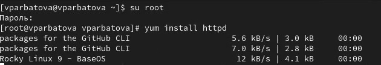{#fig:001 width=70%}

Перехожу в директорию /etc/httpd, чтобы настроить веб-сервер. Добавляю строку ServerName test.ru в файл httpd.conf, указывая имя сервера. Очищаю правила iptables, чтобы сбросить настройки фаервола. Устанавливаю политику ACCEPT для входящих подключений, разрешая входящий трафик. Устанавливаю политику ACCEPT для исходящих подключений, разрешая исходящий трафик.

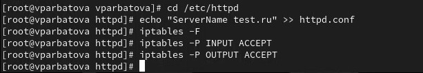{#fig:001 width=70%}

Убедилась, что SELinux работает в режиме enforcing политики targeted с помощью команд getenforce и sestatus 

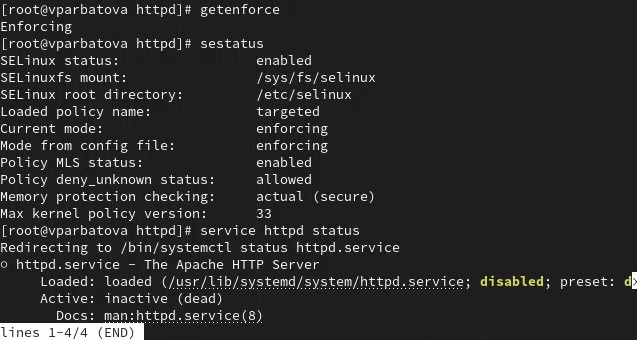{#fig:001 width=70%}

Запускаю сервер apache, далее обращаюсь с помощью браузера к веб-серверу, запущенному на компьютере, он работает, что видно из вывода команды service httpd status (рисунки 4-5)

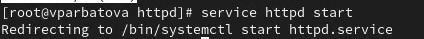{#fig:001 width=70%}

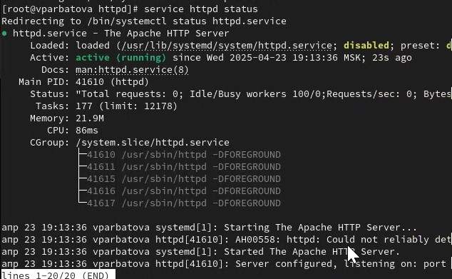{#fig:001 width=70%}

С помощью команды ps auxZ | grep httpd нашла веб-сервер Apache в списке процессов. Его контекст безопасности - httpd_t

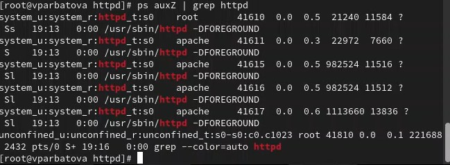{#fig:001 width=70%}

Просмотрела текущее состояние переключателей SELinux для Apache с помощью команды sestatus -bigrep httpd

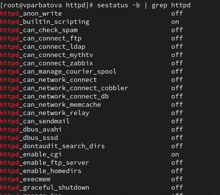{#fig:001 width=70%}

Просмотрела статистику по политике с помощью команды seinfo. Множество пользователей - 8, ролей - 39, типов - 5135

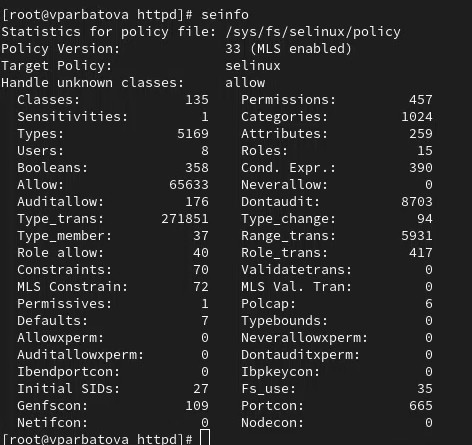{#fig:001 width=70%}

Типы поддиректорий, находящихся в директории /var/www, с помощью команды ls -lZ /var/www следующие: владелец - root, права на изменения только у владельца. Файлов в директории нет 

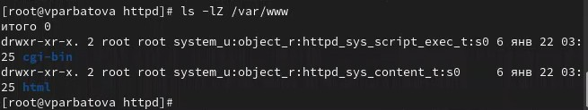{#fig:001 width=70%}

В директории /var/www/html нет файлов.

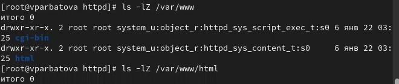{#fig:001 width=70%}

Создаю файл

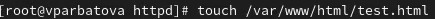{#fig:001 width=70%}

Создать файл может только суперпользователь, поэтому от его имени создаем файл touch.html cо следующим содержанием

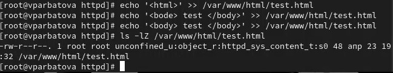{#fig:001 width=70%}

Перехожу на сайт и смотрю. Всё удачно

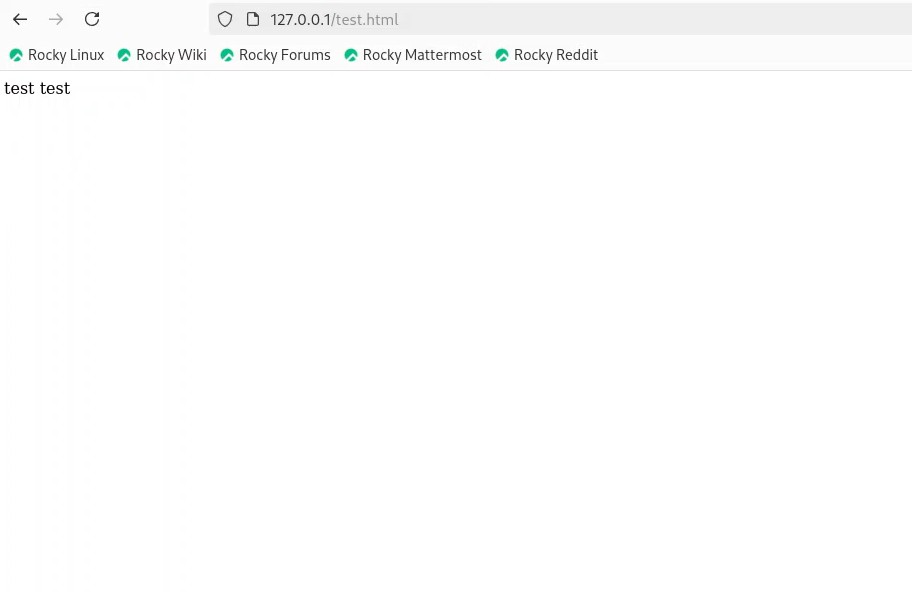{#fig:001 width=70%}

Изменяю контекст файла /var/www/html/test.html с httpd_sys_content_t на любой другой, к которому процесс httpd не должен иметь доступа, например, на samba_share_t: chcon -t samba_share_t /var/www/html/test.html ls -Z /var/www/html/test.html Контекст действительно поменялся

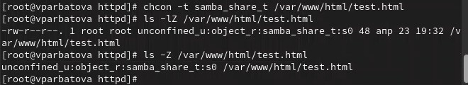{#fig:001 width=70%}

Доступ запрещен

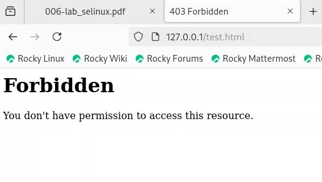{#fig:001 width=70%}

файл не был отображён, хотя права доступа позволяют читать этот файл любому пользователю, потому что установлен контекст, к которому процесс httpd не должен иметь доступа.

Просматриваю log-файлы веб-сервера Apache и системный лог-файл: tail /var/log/messages. Если в системе окажутся запущенными процессы setroubleshootd и audtd, то вы также сможете увидеть ошибки, аналогичные указанным выше, в файле /var/log/audit/audit.log

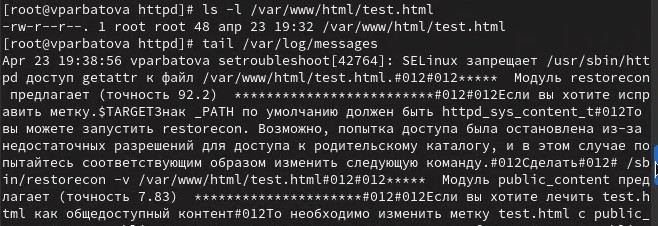{#fig:001 width=70%}

# Выводы

В ходе выполнения данной лабораторной работы были развиты навыки администрирования ОС Linux, получено первое практическое знакомство с технологией SELinux и проверена работа SELinux на практике совместно с веб-сервером Apache.

# Список литературы{.unnumbered}

::: {#refs}
:::
