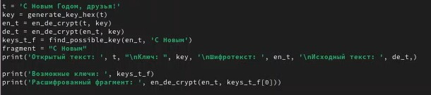

---
## Front matter
lang: ru-RU
title: Презентация по лабораторной работе № 7
subtitle: Информационная безопасность
author:
  - Арбатова В. П.
institute:
  - Российский университет дружбы народов, Москва, Россия
date: 12 мая 2025

## i18n babel
babel-lang: russian
babel-otherlangs: english

## Formatting pdf
toc: false
toc-title: Содержание
slide_level: 2
aspectratio: 169
section-titles: true
theme: metropolis
header-includes:
 - \metroset{progressbar=frametitle,sectionpage=progressbar,numbering=fraction}
---

# Выполнение лабораторной работы

##

Создаю файл питон, так как буду работать на этом языке и открываю его в редакторе

{#fig:001 width=70%}

##

Требуется разработать программу, позволяющее шифровать и дешифровать данные в режиме однократного гаммирования. Начнем с создания функции для генерации случайного ключа

{#fig:001 width=70%}

##

Необходимо определить вид шифротекста при известном ключе и известном открытом тексте. Так как операция исключающего или отменяет сама себя, делаю одну функцию и для шифрования и для дешифрования текста

{#fig:001 width=70%}

##

Нужно определить ключ, с помощью которого шифротекст может быть преобразован в некоторый фрагмент текста, представляющий собой один из возможных вариантов прочтения открытого текста. Для этого создаю функцию для нахождения возможных ключей для фрагмента текста

{#fig:001 width=70%}

##

Вывод результатов

{#fig:001 width=70%}

##

Проверяю версию питона, запускаю выполнение файла. Шифрование и дешифрование происходит верно, как и нахождение ключей, с помощью которых можно расшифровать верно только кусок текста

{#fig:001 width=70%}