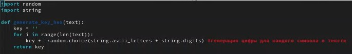
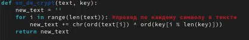
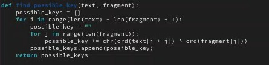
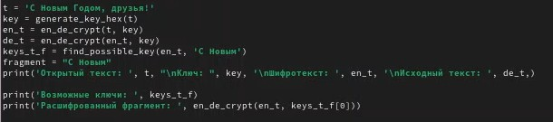
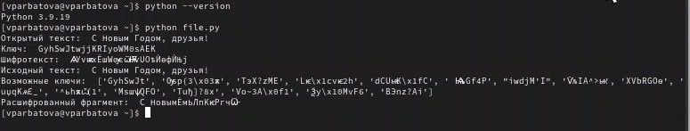

---
## Front matter
title: "Отчёт по лпбораторной работе №7"
subtitle: "Информационная безопасность"
author: "Арбатова Варвара Петровна"

## Generic otions
lang: ru-RU
toc-title: "Содержание"

## Bibliography
bibliography: bib/cite.bib
csl: pandoc/csl/gost-r-7-0-5-2008-numeric.csl

## Pdf output format
toc: true # Table of contents
toc-depth: 2
lof: true # List of figures
lot: true # List of tables
fontsize: 12pt
linestretch: 1.5
papersize: a4
documentclass: scrreprt
## I18n polyglossia
polyglossia-lang:
  name: russian
  options:
	- spelling=modern
	- babelshorthands=true
polyglossia-otherlangs:
  name: english
## I18n babel
babel-lang: russian
babel-otherlangs: english
## Fonts
mainfont: IBM Plex Serif
romanfont: IBM Plex Serif
sansfont: IBM Plex Sans
monofont: IBM Plex Mono
mathfont: STIX Two Math
mainfontoptions: Ligatures=Common,Ligatures=TeX,Scale=0.94
romanfontoptions: Ligatures=Common,Ligatures=TeX,Scale=0.94
sansfontoptions: Ligatures=Common,Ligatures=TeX,Scale=MatchLowercase,Scale=0.94
monofontoptions: Scale=MatchLowercase,Scale=0.94,FakeStretch=0.9
mathfontoptions:
## Biblatex
biblatex: true
biblio-style: "gost-numeric"
biblatexoptions:
  - parentracker=true
  - backend=biber
  - hyperref=auto
  - language=auto
  - autolang=other*
  - citestyle=gost-numeric
## Pandoc-crossref LaTeX customization
figureTitle: "Рис."
tableTitle: "Таблица"
listingTitle: "Листинг"
lofTitle: "Список иллюстраций"
lotTitle: "Список таблиц"
lolTitle: "Листинги"
## Misc options
indent: true
header-includes:
  - \usepackage{indentfirst}
  - \usepackage{float} # keep figures where there are in the text
  - \floatplacement{figure}{H} # keep figures where there are in the text
---

# Цель работы

Освоить на практике применение режима однократного гаммирования

# Задание

Нужно подобрать ключ, чтобы получить сообщение «С Новым Годом, друзья!». Требуется разработать приложение, позволяющее шифровать и дешифровать данные в режиме однократного гаммирования. Приложение должно:

Определить вид шифротекста при известном ключе и известном открытом тексте.
Определить ключ, с помощью которого шифротекст может быть преобразован в некоторый фрагмент текста, представляющий собой один из возможных вариантов прочтения открытого текста

# Теоретическое введение

Предложенная Г. С. Вернамом так называемая «схема однократного использования (гаммирования)» является простой, но надёжной схемой шифрования данных. [@course]

Гаммирование представляет собой наложение (снятие) на открытые (зашифрованные) данные последовательности элементов других данных, полученной с помощью некоторого криптографического алгоритма, для получения зашифрованных (открытых) данных. Иными словами, наложение гаммы — это сложение её элементов с элементами открытого (закрытого) текста по некоторому фиксированному модулю, значение которого представляет собой известную часть алгоритма шифрования.

В соответствии с теорией криптоанализа, если в методе шифрования используется однократная вероятностная гамма (однократное гаммирование) той же длины, что и подлежащий сокрытию текст, то текст нельзя раскрыть. Даже при раскрытии части последовательности гаммы нельзя получить информацию о всём скрываемом тексте.

Наложение гаммы по сути представляет собой выполнение операции сложения по модулю 2 (XOR) (обозначаемая знаком ⊕) между элементами гаммы и элементами подлежащего сокрытию текста. Напомним, как работает операция XOR над битами: 0 ⊕ 0 = 0, 0 ⊕ 1 = 1, 1 ⊕ 0 = 1, 1 ⊕ 1 = 0.

Такой метод шифрования является симметричным, так как двойное прибавление одной и той же величины по модулю 2 восстанавливает исходное значение, а шифрование и расшифрование выполняется одной и той же про- граммой.

Если известны ключ и открытый текст, то задача нахождения шифротекста заключается в применении к каждому символу открытого текста следующего правила:

Ci = Pi ⊕ Ki, (7.1)

где Ci — i-й символ получившегося зашифрованного послания, Pi — i-й символ открытого текста, Ki — i-й символ ключа, i = 1, m. Размерности открытого текста и ключа должны совпадать, и полученный шифротекст будет такой же длины.

Если известны шифротекст и открытый текст, то задача нахождения ключа решается также в соответствии с (7.1), а именно, обе части равенства необходимо сложить по модулю 2 с Pi:

Ci ⊕ Pi = Pi ⊕ Ki ⊕ Pi = Ki,

Ki = Ci ⊕ Pi.

Открытый текст имеет символьный вид, а ключ — шестнадцатеричное представление. Ключ также можно представить в символьном виде, воспользовавшись таблицей ASCII-кодов.

К. Шеннон доказал абсолютную стойкость шифра в случае, когда однократно используемый ключ, длиной, равной длине исходного сообщения, является фрагментом истинно случайной двоичной последовательности с равномерным законом распределения. Криптоалгоритм не даёт никакой информации об открытом тексте: при известном зашифрованном сообщении C все различные ключевые последовательности K возможны и равновероятны, а значит, возможны и любые сообщения P.

Необходимые и достаточные условия абсолютной стойкости шифра:

полная случайность ключа;

равенство длин ключа и открытого текста;

однократное использование ключа.

Рассмотрим пример.

Ключ Центра:

05 0C 17 7F 0E 4E 37 D2 94 10 09 2E 22 57 FF C8 0B B2 70 54

Сообщение Центра:

Штирлиц – Вы Герой!!

D8 F2 E8 F0 EB E8 F6 20 2D 20 C2 FB 20 C3 E5 F0 EE E9 21 21

Зашифрованный текст, находящийся у Мюллера:

DD FE FF 8F E5 A6 C1 F2 B9 30 CB D5 02 94 1A 38 E5 5B 51 75

Дешифровальщики попробовали ключ:

05 0C 17 7F 0E 4E 37 D2 94 10 09 2E 22 55 F4 D3 07 BB BC 54

и получили текст:

D8 F2 E8 F0 EB E8 F6 20 2D 20 C2 FB 20 C1 EE EB E2 E0 ED 21

Штирлиц - Вы Болван!

Другие ключи дадут лишь новые фразы, пословицы, стихотворные строфы, словом, всевозможные тексты заданной длины.

# Выполнение лабораторной работы

Создаю файл питон, так как буду работать на этом языке и открываю его в редакторе

{#fig:001 width=70%}

Требуется разработать программу, позволяющее шифровать и дешифровать данные в режиме однократного гаммирования. Начнем с создания функции для генерации случайного ключа

{#fig:001 width=70%}

Необходимо определить вид шифротекста при известном ключе и известном открытом тексте. Так как операция исключающего или отменяет сама себя, делаю одну функцию и для шифрования и для дешифрования текста

{#fig:001 width=70%}

Нужно определить ключ, с помощью которого шифротекст может быть преобразован в некоторый фрагмент текста, представляющий собой один из возможных вариантов прочтения открытого текста. Для этого создаю функцию для нахождения возможных ключей для фрагмента текста

{#fig:001 width=70%}

Вывод результатов

{#fig:001 width=70%}

Проверяю версию питона, запускаю выполнение файла. Шифрование и дешифрование происходит верно, как и нахождение ключей, с помощью которых можно расшифровать верно только кусок текста

{#fig:001 width=70%}

import random
import string

def generate_key_hex(text):
    key = ''
    for i in range(len(text)):
        key += random.choice(string.ascii_letters + string.digits) #генерация цифры для каждого символа в тексте
    return key

#для шифрования и дешифрования
def en_de_crypt(text, key):
    new_text = ''
    for i in range(len(text)): #проход по каждому символу в тексте
        new_text += chr(ord(text[i]) ^ ord(key[i % len(key)]))
    return new_text

def find_possible_key(text, fragment):
    possible_keys = []
    for i in range(len(text) - len(fragment) + 1):
        possible_key = ""
        for j in range(len(fragment)):
            possible_key += chr(ord(text[i + j]) ^ ord(fragment[j]))
        possible_keys.append(possible_key)
    return possible_keys

t = 'С Новым Годом, друзья!'
key = generate_key_hex(t)
en_t = en_de_crypt(t, key)
de_t = en_de_crypt(en_t, key)
keys_t_f = find_possible_key(en_t, 'С Новым')
fragment = "С Новым"
print('Открытый текст: ', t, "\nКлюч: ", key, '\nШифротекст: ', en_t, '\nИсходный текст: ', de_t,)

print('Возможные ключи: ', keys_t_f)
print('Расшифрованный фрагмент: ', en_de_crypt(en_t, keys_t_f[0]))

# Ответы на контрольные вопросы

Поясните смысл однократного гаммирования. - Однократное гаммирование - это метод шифрования, при котором каждый символ открытого текста гаммируется с соответствующим символом ключа только один раз.

Перечислите недостатки однократного гаммирования. - Недостатки однократного гаммирования:

Уязвимость к частотному анализу из-за сохранения частоты символов открытого текста в шифротексте.
Необходимость использования одноразового ключа, который должен быть длиннее самого открытого текста.
Нет возможности использовать один ключ для шифрования разных сообщений.
Перечислите преимущества однократного гаммирования. - Преимущества однократного гаммирования:
Высокая стойкость при правильном использовании случайного ключа.
Простота реализации алгоритма.
Возможность использования случайного ключа.
Почему длина открытого текста должна совпадать с длиной ключа? - Длина открытого текста должна совпадать с длиной ключа, чтобы каждый символ открытого текста гаммировался с соответствующим символом ключа.

Какая операция используется в режиме однократного гаммирования, назовите её особенности? - В режиме однократного гаммирования используется операция XOR (исключающее ИЛИ), которая объединяет двоичные значения символов открытого текста и ключа для получения шифротекста. Особенность XOR - если один из битов равен 1, то результат будет 1, иначе 0.

Как по открытому тексту и ключу получить шифротекст? - Для получения шифротекста по открытому тексту и ключу каждый символ открытого текста гаммируется с соответствующим символом ключа с помощью операции XOR.

Как по открытому тексту и шифротексту получить ключ? - По открытому тексту и шифротексту невозможно восстановить действительный ключ, так как для этого нужна информация о каждом символе ключа.

В чем заключаются необходимые и достаточные условия абсолютной стойкости шифра - Необходимые и достаточные условия абсолютной стойкости шифра:

Ключи должны быть случайными и использоваться только один раз.
Длина ключа должна быть не менее длины самого открытого текста.
Ключи должны быть храниться и передаваться безопасным способом.

# Выводы

В ходе выполнения данной лабораторной работы мной было освоено на практике применение режима однократного гаммирования.

# Список литературы{.unnumbered}

::: {#refs}
:::
