---
## Front matter
lang: ru-RU
title: Презентация по первому этапу индивидуального проекта
subtitle: Информационная безопасность
author:
  - Арбатова В. П.
institute:
  - Российский университет дружбы народов, Москва, Россия
date: 05 марта 2025

## i18n babel
babel-lang: russian
babel-otherlangs: english

## Formatting pdf
toc: false
toc-title: Содержание
slide_level: 2
aspectratio: 169
section-titles: true
theme: metropolis
header-includes:
 - \metroset{progressbar=frametitle,sectionpage=progressbar,numbering=fraction}
---

# Цель работы

Приобретение практических навыков по установке операционной системы Linux на виртуальную машину.

# Задание

Установить дистрибутив Kali Linux на виртуальную машину VirtualBox.

# Теоретическое введение

Kali Linux — это дистрибутив Linux на основе Debian с открытым исходным кодом, предназначенный для расширенного тестирования на проникновение, проверки уязвимостей, аудита безопасности систем и сетей.

Сферы применения дистрибутива:

Тестирование на проникновение. Kali Linux широко используется в области тестирования безопасности, чтобы оценить уязвимости в компьютерных системах, сетях и приложениях. ОС предоставляет множество инструментов для обнаружения уязвимостей.

Цифровое расследование. Дистрибутив предоставляет инструменты для сбора и анализа цифровых данных, включая восстановление удаленных файлов, извлечение метаданных, анализ системных журналов и т.д.

Обратная разработка. Kali Linux содержит инструменты, которые помогают разработчикам анализировать готовое программное обеспечение, чтобы понять его работу, выявить уязвимости или разработать альтернативные реализации.

Безопасность беспроводных сетей. У ОС есть набор инструментов для проверки и обеспечения безопасности беспроводных сетей. Kali Linux поддерживает анализ беспроводных протоколов, перехват и дешифрование сетевого трафика, а также атаки на беспроводные сети.

Защита информации. Kali Linux также может использоваться для обеспечения безопасности информации, включая мониторинг сетевой активности, обнаружение вторжений, защиту от DDoS-атак и настройку брандмауэров.

# Выполнение лабораторной работы

##

Начиню создание. Называю машину, устанавливаю тип, подтип и версию

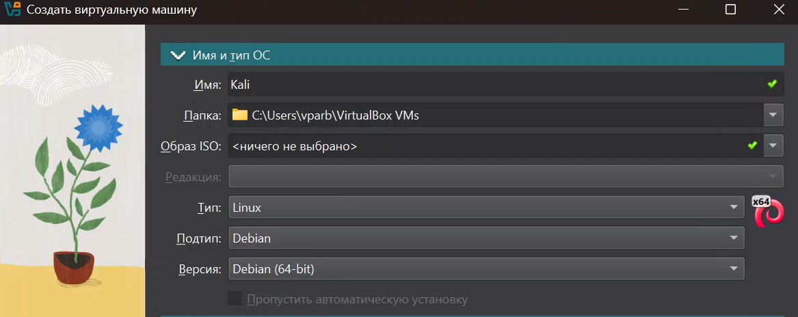{#fig:001 width=70%}

##

Выделю 4096 Мб основной памяти и 3 процессора

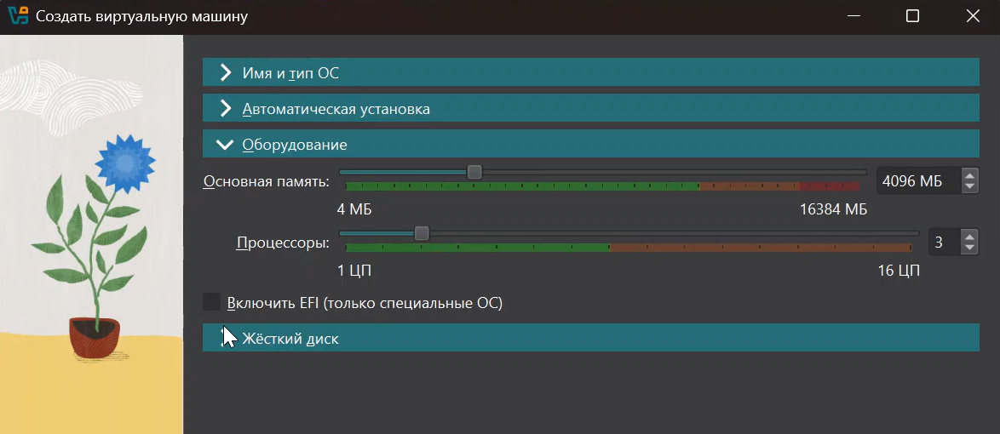{#fig:001 width=70%}

##

Создаю новый виртуальный диск на 40 Гб

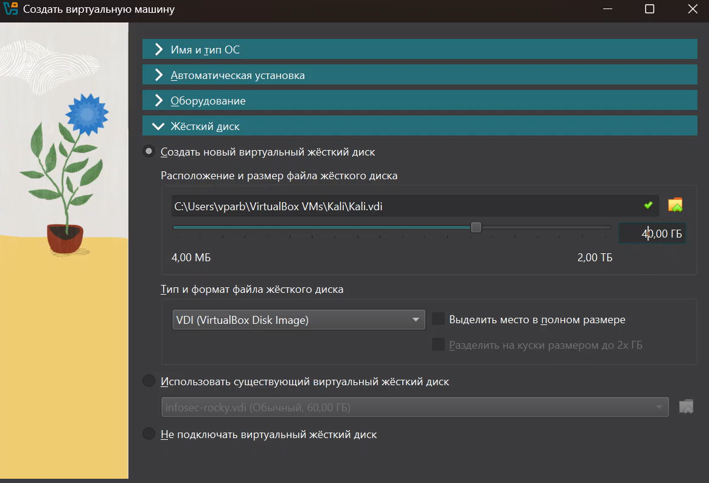{#fig:001 width=70%}

##

В настройках захожу в носители, в контроллеры добавляю установленный с официального сайта образ диска

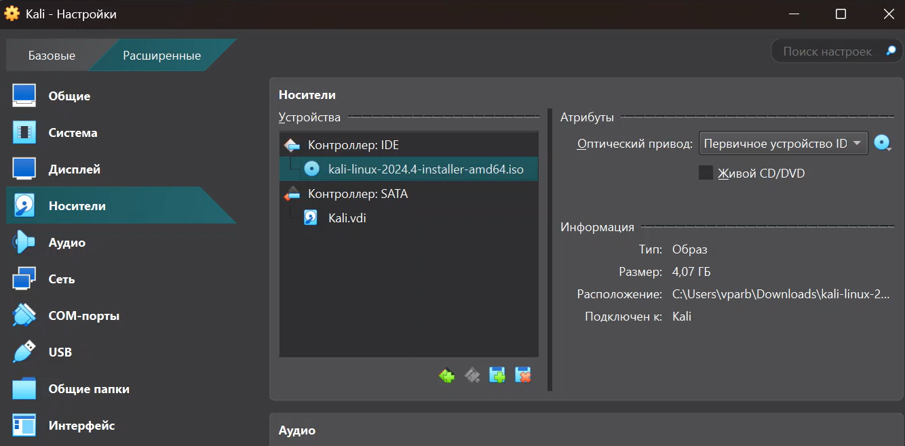{#fig:001 width=70%}

##

Запускаю машину

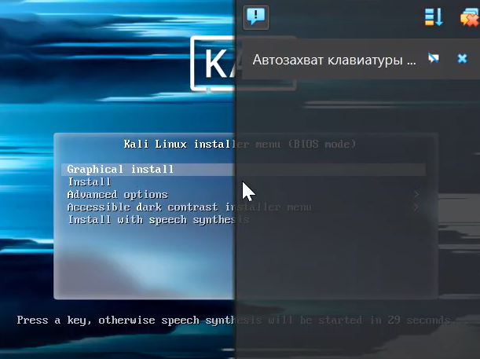{#fig:001 width=70%}

##

Выбираю графическую установку

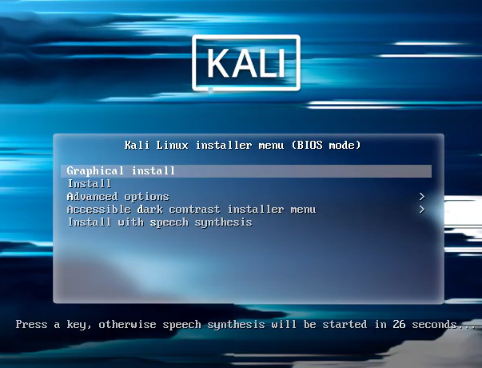{#fig:001 width=70%}

##

Выбираю русский язык

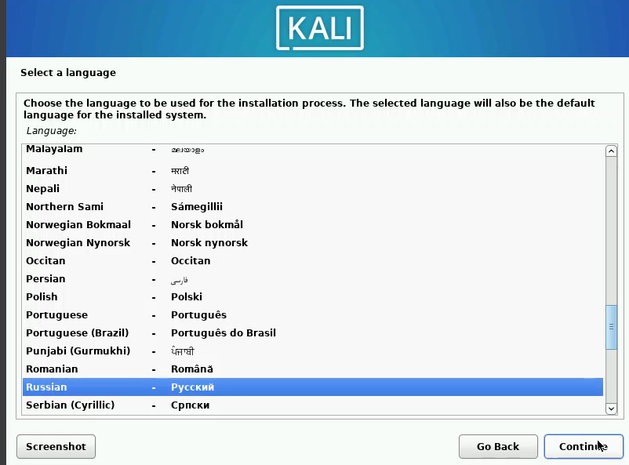{#fig:001 width=70%}

##

Вбиваю имя этого компьютера, согласно соглашению об именовании

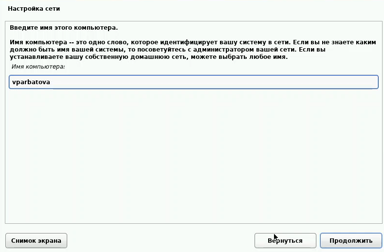{#fig:001 width=70%}

##

Ввожу так же имя домена

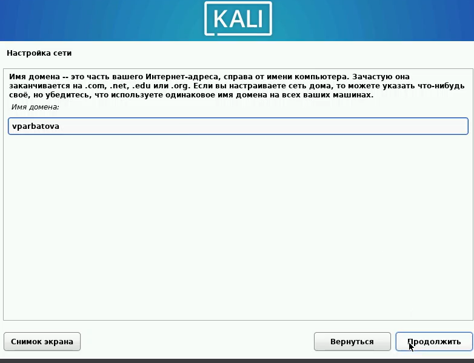{#fig:001 width=70%}

##

Ввожу имя пользователя

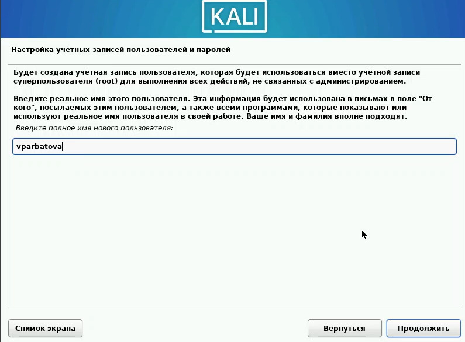{#fig:001 width=70%}

##

Следующее имя учётной записи задается автоматически

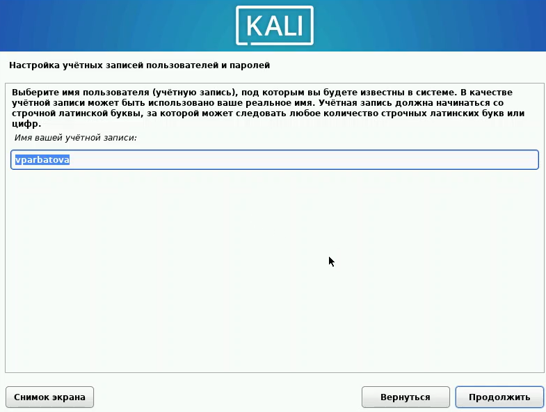{#fig:001 width=70%}

##

Задаю пароль

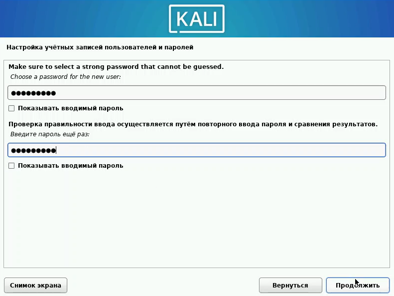{#fig:001 width=70%}

##

Выбираю время

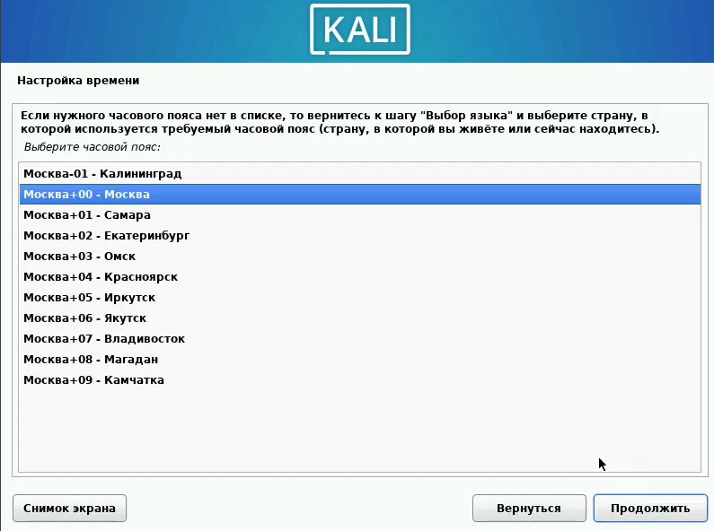{#fig:001 width=70%}

##

Выбираю использовать весь диск, чтобы всё прошло автоматически

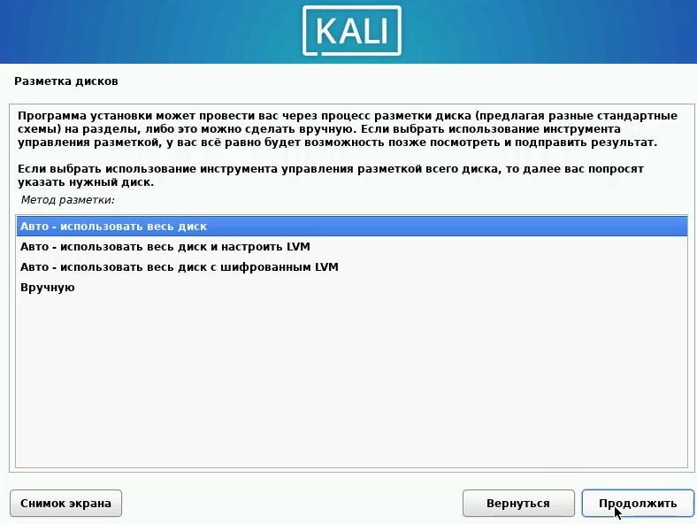{#fig:001 width=70%}

##

Выбора нет, выбираю единственный предложенный

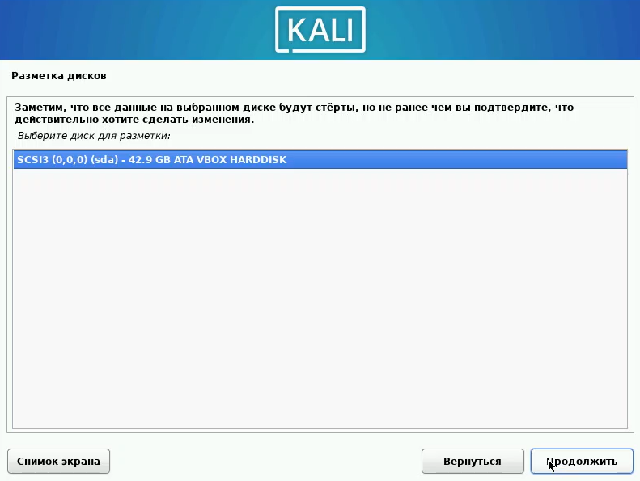{#fig:001 width=70%}

##

Читаю, что написано и выполняю инструкцию

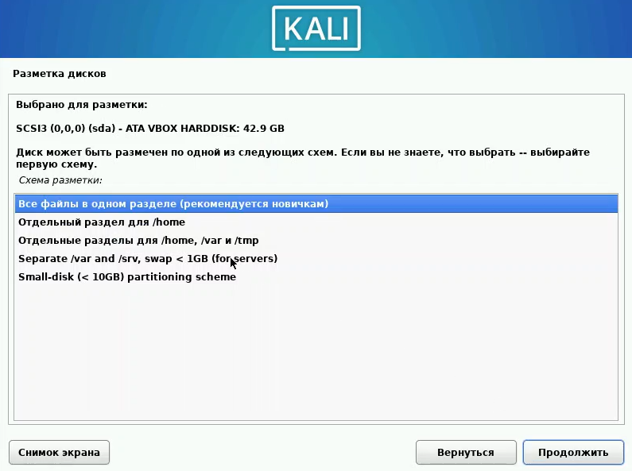{#fig:001 width=70%}

##

Заканчиваю разметку и записываю изменения на диск

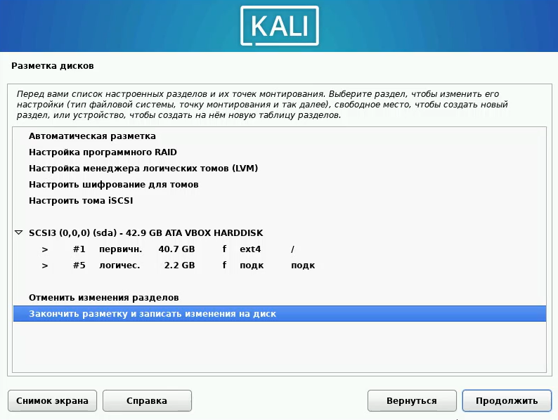{#fig:001 width=70%}

##

Выбираю да. Если выбрать нет, машина не запустится

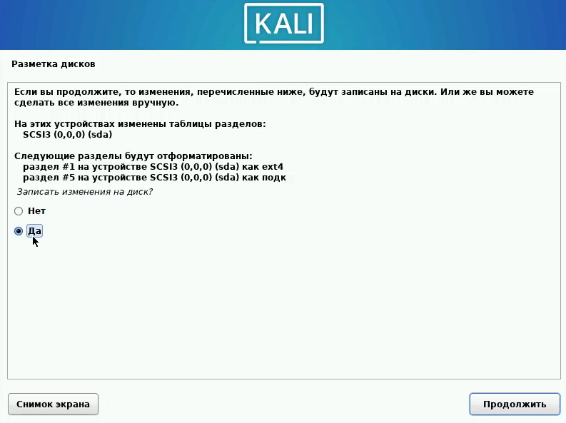{#fig:001 width=70%}

##

Ничего не меняю, всё правильно 

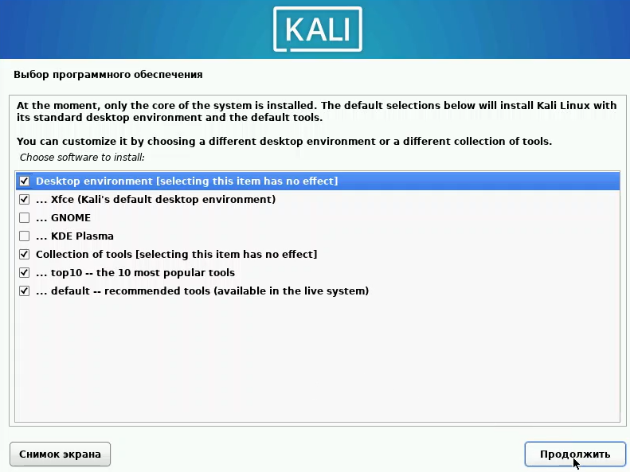{#fig:001 width=70%}

##

Выбираю автоматический вариант

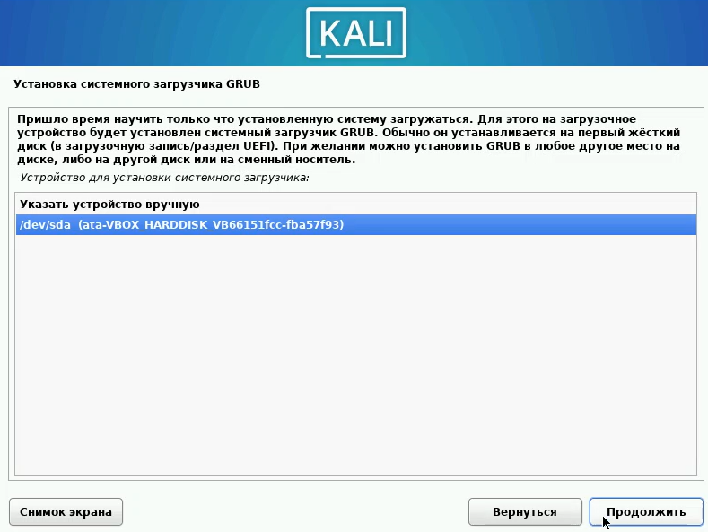{#fig:001 width=70%}

##

Установка завершена. Нажимаю продолжить

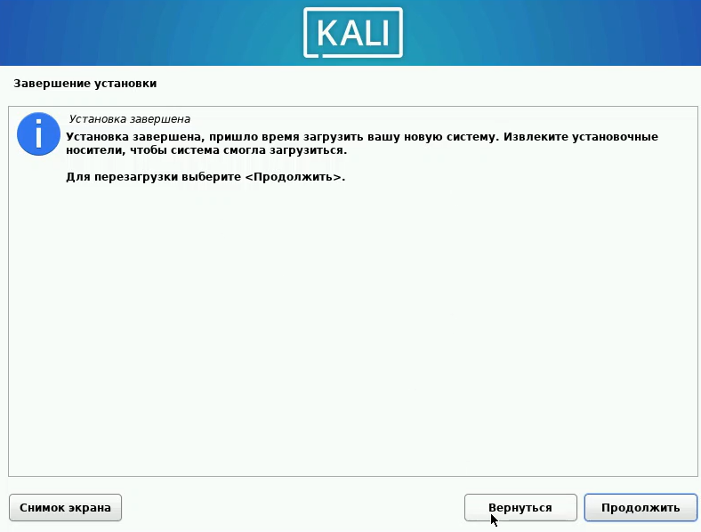{#fig:001 width=70%}

##

Готова виртуальная машина

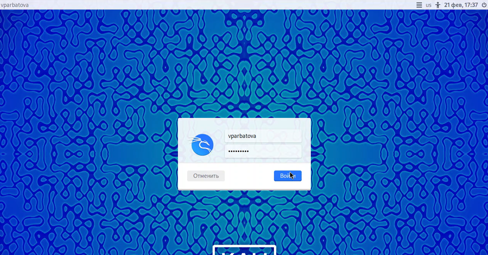{#fig:001 width=70%}

# Выводы

Приобрела практические навыки по установке операционной системы Linux на виртуальную машину. Установила дистрибутив Kali LInux на VirtualBox.