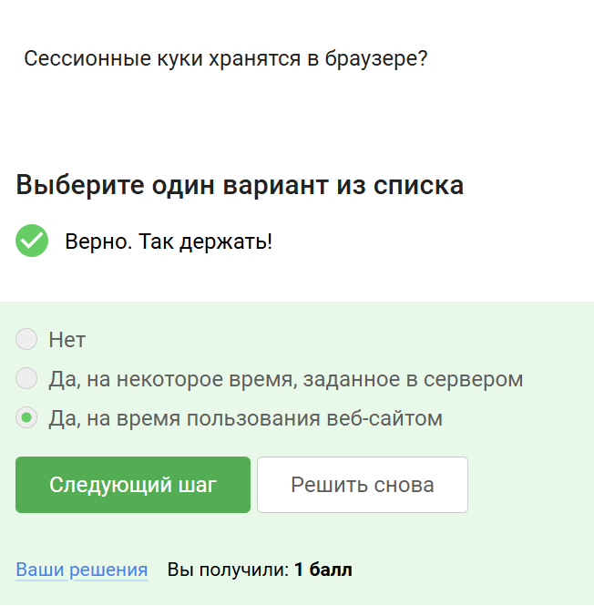
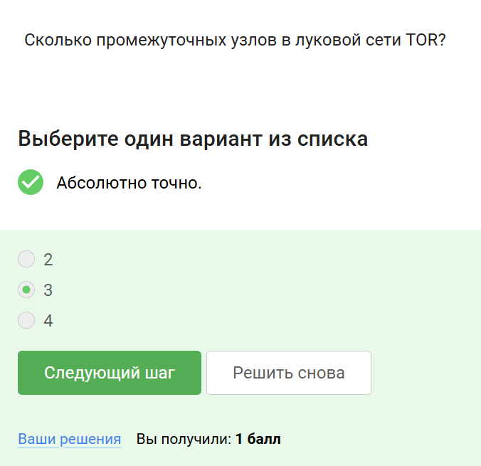

---
## Front matter
title: "Отчёт по лабораторной работе"
subtitle: "Информационная безопасность"
author: "Арбатова Варвара Петровна"

## Generic otions
lang: ru-RU
toc-title: "Содержание"

## Bibliography
bibliography: bib/cite.bib
csl: pandoc/csl/gost-r-7-0-5-2008-numeric.csl

## Pdf output format
toc: true # Table of contents
toc-depth: 2
lof: true # List of figures
lot: true # List of tables
fontsize: 12pt
linestretch: 1.5
papersize: a4
documentclass: scrreprt
## I18n polyglossia
polyglossia-lang:
  name: russian
  options:
	- spelling=modern
	- babelshorthands=true
polyglossia-otherlangs:
  name: english
## I18n babel
babel-lang: russian
babel-otherlangs: english
## Fonts
mainfont: IBM Plex Serif
romanfont: IBM Plex Serif
sansfont: IBM Plex Sans
monofont: IBM Plex Mono
mathfont: STIX Two Math
mainfontoptions: Ligatures=Common,Ligatures=TeX,Scale=0.94
romanfontoptions: Ligatures=Common,Ligatures=TeX,Scale=0.94
sansfontoptions: Ligatures=Common,Ligatures=TeX,Scale=MatchLowercase,Scale=0.94
monofontoptions: Scale=MatchLowercase,Scale=0.94,FakeStretch=0.9
mathfontoptions:
## Biblatex
biblatex: true
biblio-style: "gost-numeric"
biblatexoptions:
  - parentracker=true
  - backend=biber
  - hyperref=auto
  - language=auto
  - autolang=other*
  - citestyle=gost-numeric
## Pandoc-crossref LaTeX customization
figureTitle: "Рис."
tableTitle: "Таблица"
listingTitle: "Листинг"
lofTitle: "Список иллюстраций"
lotTitle: "Список таблиц"
lolTitle: "Листинги"
## Misc options
indent: true
header-includes:
  - \usepackage{indentfirst}
  - \usepackage{float} # keep figures where there are in the text
  - \floatplacement{figure}{H} # keep figures where there are in the text
---

# Цель работы

Приобретение практических навыков по установке операционной системы Linux на виртуальную машину.

# Задание

Установить дистрибутив Kali Linux на виртуальную машину VirtualBox.

# Теоретическое введение

Kali Linux — это дистрибутив Linux на основе Debian с открытым исходным кодом, предназначенный для расширенного тестирования на проникновение, проверки уязвимостей, аудита безопасности систем и сетей.

Сферы применения дистрибутива:

Тестирование на проникновение. Kali Linux широко используется в области тестирования безопасности, чтобы оценить уязвимости в компьютерных системах, сетях и приложениях. ОС предоставляет множество инструментов для обнаружения уязвимостей.

Цифровое расследование. Дистрибутив предоставляет инструменты для сбора и анализа цифровых данных, включая восстановление удаленных файлов, извлечение метаданных, анализ системных журналов и т.д.

Обратная разработка. Kali Linux содержит инструменты, которые помогают разработчикам анализировать готовое программное обеспечение, чтобы понять его работу, выявить уязвимости или разработать альтернативные реализации.

Безопасность беспроводных сетей. У ОС есть набор инструментов для проверки и обеспечения безопасности беспроводных сетей. Kali Linux поддерживает анализ беспроводных протоколов, перехват и дешифрование сетевого трафика, а также атаки на беспроводные сети.

Защита информации. Kali Linux также может использоваться для обеспечения безопасности информации, включая мониторинг сетевой активности, обнаружение вторжений, защиту от DDoS-атак и настройку брандмауэров.

# Выполнение лабораторной работы

Начиню создание. Называю машину, устанавливаю тип, подтип и версию

{#fig:001 width=70%}

Выделю 4096 Мб основной памяти и 3 процессора

{#fig:001 width=70%}

Создаю новый виртуальный диск на 40 Гб

{#fig:001 width=70%}

В настройках захожу в носители, в контроллеры добавляю установленный с официального сайта образ диска

{#fig:001 width=70%}

Запускаю машину

{#fig:001 width=70%}

Выбираю графическую установку

{#fig:001 width=70%}

Выбираю русский язык

{#fig:001 width=70%}

Вбиваю имя этого компьютера, согласно соглашению об именовании

{#fig:001 width=70%}

Ввожу так же имя домена

{#fig:001 width=70%}

Ввожу имя пользователя

{#fig:001 width=70%}

Следующее имя учётной записи задается автоматически

{#fig:001 width=70%}

Задаю пароль

{#fig:001 width=70%}

Выбираю время

{#fig:001 width=70%}

Выбираю использовать весь диск, чтобы всё прошло автоматически

{#fig:001 width=70%}

Выбора нет, выбираю единственный предложенный

{#fig:001 width=70%}

Читаю, что написано и выполняю инструкцию

{#fig:001 width=70%}

Заканчиваю разметку и записываю изменения на диск

{#fig:001 width=70%}

Выбираю да. Если выбрать нет, машина не запустится

{#fig:001 width=70%}

Ничего не меняю, всё правильно 

{#fig:001 width=70%}

Выбираю автоматический вариант

{#fig:001 width=70%}

Установка завершена. Нажимаю продолжить

{#fig:001 width=70%}

Готова виртуальная машина

{#fig:001 width=70%}

# Выводы

Приобрела практические навыки по установке операционной системы Linux на виртуальную машину. Установила дистрибутив Kali LInux на VirtualBox.

# Список литературы{.unnumbered}

::: {#refs}
:::
