---
## Front matter
title: "Отчёт второму этапу индивидуального проекта"
subtitle: "Информационная безопасность"
author: "Арбатова Варвара Петровна"

## Generic otions
lang: ru-RU
toc-title: "Содержание"

## Bibliography
bibliography: bib/cite.bib
csl: pandoc/csl/gost-r-7-0-5-2008-numeric.csl

## Pdf output format
toc: true # Table of contents
toc-depth: 2
lof: true # List of figures
lot: true # List of tables
fontsize: 12pt
linestretch: 1.5
papersize: a4
documentclass: scrreprt
## I18n polyglossia
polyglossia-lang:
  name: russian
  options:
	- spelling=modern
	- babelshorthands=true
polyglossia-otherlangs:
  name: english
## I18n babel
babel-lang: russian
babel-otherlangs: english
## Fonts
mainfont: IBM Plex Serif
romanfont: IBM Plex Serif
sansfont: IBM Plex Sans
monofont: IBM Plex Mono
mathfont: STIX Two Math
mainfontoptions: Ligatures=Common,Ligatures=TeX,Scale=0.94
romanfontoptions: Ligatures=Common,Ligatures=TeX,Scale=0.94
sansfontoptions: Ligatures=Common,Ligatures=TeX,Scale=MatchLowercase,Scale=0.94
monofontoptions: Scale=MatchLowercase,Scale=0.94,FakeStretch=0.9
mathfontoptions:
## Biblatex
biblatex: true
biblio-style: "gost-numeric"
biblatexoptions:
  - parentracker=true
  - backend=biber
  - hyperref=auto
  - language=auto
  - autolang=other*
  - citestyle=gost-numeric
## Pandoc-crossref LaTeX customization
figureTitle: "Рис."
tableTitle: "Таблица"
listingTitle: "Листинг"
lofTitle: "Список иллюстраций"
lotTitle: "Список таблиц"
lolTitle: "Листинги"
## Misc options
indent: true
header-includes:
  - \usepackage{indentfirst}
  - \usepackage{float} # keep figures where there are in the text
  - \floatplacement{figure}{H} # keep figures where there are in the text
---

# Цель работы

Установить DVWA в гостевую систему к Kali Linux.

# Задание

Установите DVWA в гостевую систему к Kali Linux.

# Теоретическое введение

Некоторые из уязвимостей веб приложений, который содержит DVWA:

Брутфорс: Брутфорс HTTP формы страницы входа - используется для тестирования инструментов по атаке на пароль методом грубой силы и показывает небезопасность слабых паролей.

Исполнение (внедрение) команд: Выполнение команд уровня операционной системы.

Межсайтовая подделка запроса (CSRF): Позволяет «атакующему» изменить пароль администратора приложений.

Внедрение (инклуд) файлов: Позволяет «атакующему» присоединить удалённые/локальные файлы в веб приложение.

SQL внедрение: Позволяет «атакующему» внедрить SQL выражения в HTTP из поля ввода, DVWA включает слепое и основанное на ошибке SQL внедрение.

Небезопасная выгрузка файлов: Позволяет «атакующему» выгрузить вредоносные файлы на веб сервер.

Межсайтовый скриптинг (XSS): «Атакующий» может внедрить свои скрипты в веб приложение/базу данных. DVWA включает отражённую и хранимую XSS.

Пасхальные яйца: раскрытие полных путей, обход аутентификации и некоторые другие.

DVWA имеет три уровня безопасности, они меняют уровень безопасности каждого веб приложения в DVWA:

Невозможный — этот уровень должен быть безопасным от всех уязвимостей. Он используется для сравнения уязвимого исходного кода с безопасным исходным кодом.

Высокий — это расширение среднего уровня сложности, со смесью более сложных или альтернативных плохих практик в попытке обезопасить код. Уязвимости не 
позволяют такой простор эксплуатации как на других уровнях.

Средний — этот уровень безопасности предназначен главным образом для того, чтобы дать пользователю пример плохих практик безопасности, где разработчик попытался сделать приложение безопасным, но потерпел неудачу.

Низкий — этот уровень безопасности совершенно уязвим и совсем не имеет защиты. Его предназначение быть примером среди уязвимых веб приложений, примером плохих практик программирования и служить платформой обучения базовым техникам эксплуатации.

# Выполнение лабораторной работы

Настройка DVWA происходит на нашем локальном хосте, поэтому нужно перейти в директорию /var/www/html. Затем клонирую нужный репозиторий GitHub, указанный в задании к этоому этапу индивидуального проекта

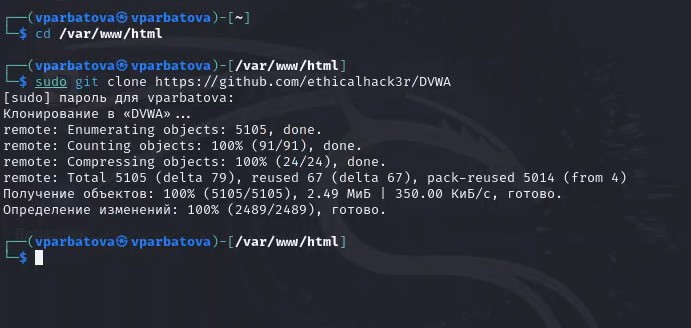{#fig:001 width=70%}

Проверяю, что всё правильно скопировалось и добавляю права на этот файл, чтобы у меня был полный доступ к нему

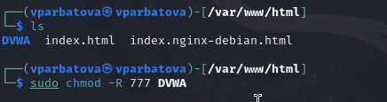{#fig:002 width=70%}

Перехожу в папку и смотрю, какие в ней файлы

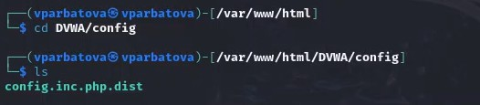{#fig:003 width=70%}

Копирую файл и проверяю, как он скопировался. Делаю это для того, чтобы в случае, если что-то пойдет не так, у меня был запасной вариант

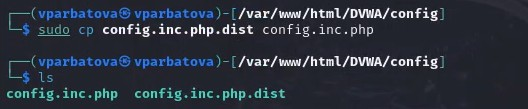{#fig:004 width=70%}

Открываю файл в текстовом редакторе

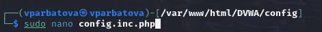{#fig:005 width=70%}

Меняю информацию об имени пользователя и пароле

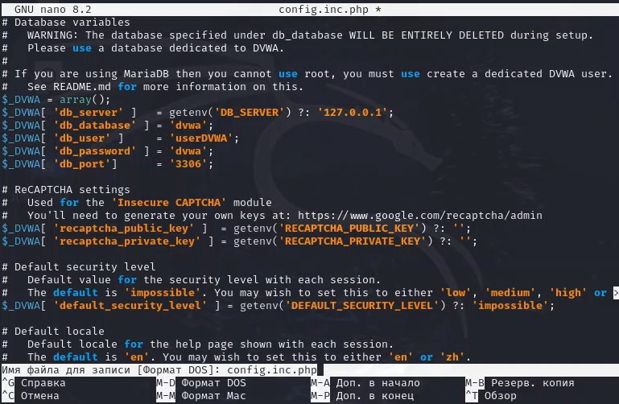{#fig:006 width=70%}

Запускаю mysql, он изначально установлен в Kali Linux, поэтому скачивать не надо и проверяю, запустился ли

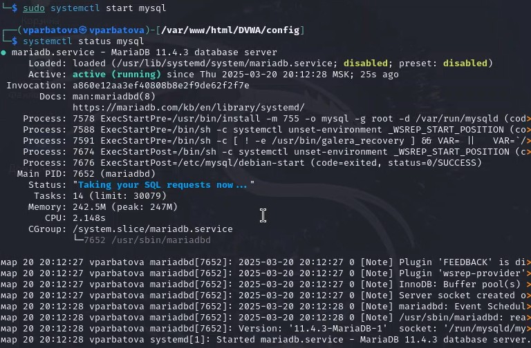{#fig:007 width=70%}

Авторизуюсь в базе данных от имени пользователя root. Появляется командная строка с приглашением "MariaDB", далее создаем в ней нового пользователя, используя учетные данные из файла config.inc.php

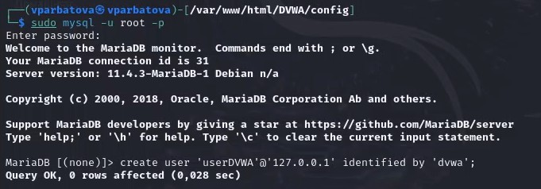{#fig:008 width=70%}

Выдаю пользователю все привилегии и выхожу

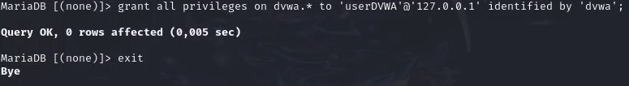{#fig:009 width=70%}

Теперь надо настроить сервер apache2, для этого перехожу в соответствующую директорию

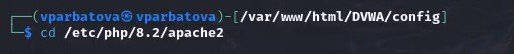{#fig:010 width=70%}

Открываю файл в текстовом редакторе

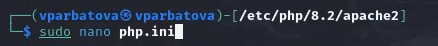{#fig:011 width=70%}

Нахожу параметры allow_url_fopen и allow_url_include. Эти параметры должны быть on

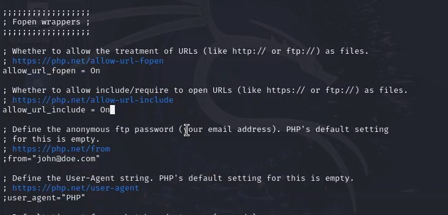{#fig:012 width=70%}

Запускаю apache2 и проверяю статус, чтобы убедиться, что он действительно запущен

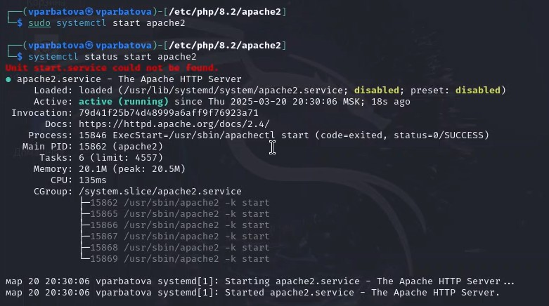{#fig:0013 width=70%}

В браузере вбиваю 127.0.0.1/DVWA и попадаю на сайт, где нужно авторизироваться

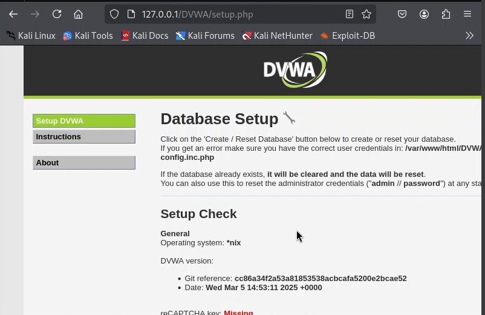{#fig:014 width=70%}

Прокручиваем страницу вниз и нажимаем на кнопку

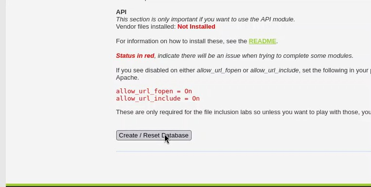{#fig:015 width=70%}

Вхожу с данными, предложенными по умолчанию

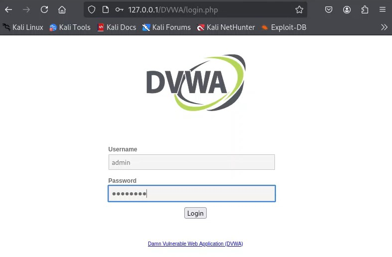{#fig:016 width=70%}

# Выводы

Установила DVWA в гостевую систему к Kali Linux.

# Список литературы{.unnumbered}

::: {#refs}
:::
