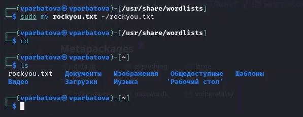
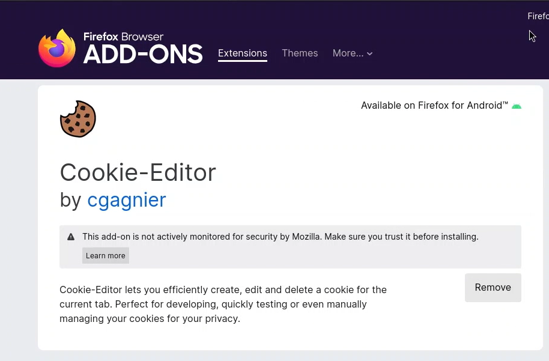
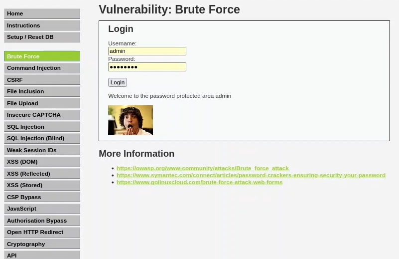

---
## Front matter
lang: ru-RU
title: Презентация по третьему этапу индивидуального проекта
subtitle: Информационная безопасность
author:
  - Арбатова В. П.
institute:
  - Российский университет дружбы народов, Москва, Россия
date: 10 апреля 2025

## i18n babel
babel-lang: russian
babel-otherlangs: english

## Formatting pdf
toc: false
toc-title: Содержание
slide_level: 2
aspectratio: 169
section-titles: true
theme: metropolis
header-includes:
 - \metroset{progressbar=frametitle,sectionpage=progressbar,numbering=fraction}
---

# Цель работы

Приобретение практических навыков по использованию инструмента Hydra для брутфорса паролей.

# Задание

Реализовать эксплуатацию уязвимости с помощью брутфорса паролей.

# Теоретическое введение

Hydra используется для подбора или взлома имени пользователя и пароля.
Поддерживает подбор для большого набора приложений [@brute, @force, @parasram].
Пример работы:

Исходные данные:

IP сервера 178.72.90.181;

Сервис http на стандартном 80 порту;

Для авторизации используется html форма, которая отправляет по адресу http://178.72.90.181/cgi-bin/luci методом POST запрос вида username=root&password=test_password;

В случае неудачной аутентификации пользователь наблюдает сообщение Invalid username and/or password! Please try again.

Запрос к Hydra будет выглядеть примерно так:

hydra -l root -P ~/pass_lists/dedik_passes.txt -o ./hydra_result.log -f -V -s 80 178.72.90.181 http-post-form "/cgi-bin/luci:username=^USER^&password=^PASS^:Invalid username"

Используется http-post-form потому, что авторизация происходит по http методом post.

После указания этого модуля идёт строка /cgi-bin/luci:username=^USER^&password=^PASS^:Invalid username, у которой через двоеточие (:) указывается:

путь до скрипта, который обрабатывает процесс аутентификации (/cgi-bin/luci);

строка, которая передаётся методом POST, в которой логин и пароль заменены на ^USER^ и ^PASS^ соответственно (username=^USER^&password=^PASS^);

строка, которая присутствует на странице при неудачной аутентификации; при её отсутствии Hydra поймёт, что мы успешно вошли (Invalid username).

# Выполнение лабораторной работы

##

Чтобы пробрутфорсить пароль, нужно сначала найти большой список частоиспользуемых паролей. Его можно найти в открытых источниках, я взяла стандартный список паролей rockyou.txt для kali linux

{#fig:001 width=70%}

##

Перемещаю файл и проверяю, получилось ли

{#fig:001 width=70%}

##

Скачиваю cookie-Editor, чтобы получить информацию о параметрах cookie 

{#fig:001 width=70%}

##

Ввожу в Hydra запрос нужную информацию. Пароль будем подбирать для пользователя admin, используем GET-запрос с двумя параметрами cookie: безопасность и PHPSESSID, найденными в прошлом пункте

{#fig:001 width=70%}

##

Вхожу - вход выполнен успешно

{#fig:001 width=70%}

# Выводы

Приобрела практические навыки по использованию инструмента Hydra для брутфорса паролей

# Список литературы{.unnumbered}

::: {#refs}
:::
