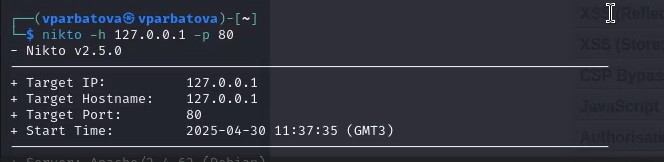

---
## Front matter
lang: ru-RU
title: Презентация по четвёртому этапу индивидуального проекта
subtitle: Информационная безопасность
author:
  - Арбатова В. П.
institute:
  - Российский университет дружбы народов, Москва, Россия
date: 30 апреля 2025

## i18n babel
babel-lang: russian
babel-otherlangs: english

## Formatting pdf
toc: false
toc-title: Содержание
slide_level: 2
aspectratio: 169
section-titles: true
theme: metropolis
header-includes:
 - \metroset{progressbar=frametitle,sectionpage=progressbar,numbering=fraction}
---

# Цель работы

Научиться тестированию веб-приложений с помощью сканера nikto

# Задание

Использование nikto.

# Теоретическое введение

nikto — базовый сканер безопасности веб-сервера. Он сканирует и обнаруживает уязвимости в веб-приложениях, обычно вызванные неправильной конфигурацией на самом сервере, файлами, установленными по умолчанию, и небезопасными файлами, а также устаревшими серверными приложениями. Поскольку nikto построен исключительно на LibWhisker2, он сразу после установки поддерживает кросс-платформенное развертывание, SSL (криптографический протокол, который подразумевает более безопасную связь), методы аутентификации хоста (NTLM/Basic), прокси и несколько методов уклонения от идентификаторов. Он также поддерживает перечисление поддоменов, проверку безопасности приложений (XSS, SQL-инъекции и т. д.) и способен с помощью атаки паролей на основе словаря угадывать учетные данные авторизации.

Для запуска сканера nikto введите в командную строку терминала команду: # nikto

По умолчанию, как ранее было показано в других приложениях, при обычном запуске команды отображаются различные доступные параметры. Для сканирования цели введите nikto -h <цель> -p <порт>, где <цель> — домен или IP-адрес целевого сайта, а <порт> — порт, на котором запущен сервис

Сканер nikto позволяет идентифицировать уязвимости веб-приложений, такие как раскрытие информации, инъекция (XSS/Script/HTML), удаленный поиск файлов (на уровне сервера), выполнение команд и идентификация программного обеспечения. В дополнение к показанному ранее основному сканированию nikto позволяет испытателю на проникновение настроить сканирование конкретной цели. Рассмотрим параметры, которые следует использовать при сканировании.

Указав переключатель командной строки -T с отдельными номерами тестов, можно настроить тестирование конкретных типов.
Используя при тестировании параметр -t, вы можете установить значение тайм-аута для каждого ответа.
Параметр -D V управляет выводом на экран.
Параметры -o и -F отвечают за выбор формата отчета сканирования.
Существуют и другие параметры, такие как -mutate (угадывать поддомены, файлы, каталоги и имена пользователей), -evasion (обходить фильтр идентификаторов) и -Single (для одиночного тестового режима), которые можно использовать для углубленной оценки цели [@parasram].

# Выполнение лабораторной работы

##

Чтобы работать с nikto, необходимо подготовить веб-приложение, которое будем сканировать. Это будет DVWA. Для этого запустила apache2 (рис. [-@fig:001]).

{#fig:001 width=70%}

##

Ввожу в адресной строке браузера адрес DVWA, перехожу в режим выбора уровня безопасности, ставлю минимальный (необязательно, nikto при обычном сканировании для режима impossible и low выдаст одинаковые потенциальные уязвимости, что логично, ведь они остаются, но изменяется сложность, с которой их можно использовать)

{#fig:001 width=70%}

##

Запуск nikto

{#fig:001 width=70%}

##

Проверить веб-приложение можно, введя его полный URL и не вводя порт, попробовала просканировать так

{#fig:001 width=70%}

##

Затем попробовала просканировать введя адрес хоста и адрес порта, результаты незначительно отличаются

{#fig:001 width=70%}

# Выводы

Научилась использовать сканер nikto для тестирования веб-приложений

# Список литературы{.unnumbered}

::: {#refs}
:::
