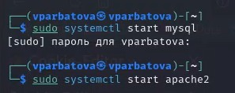
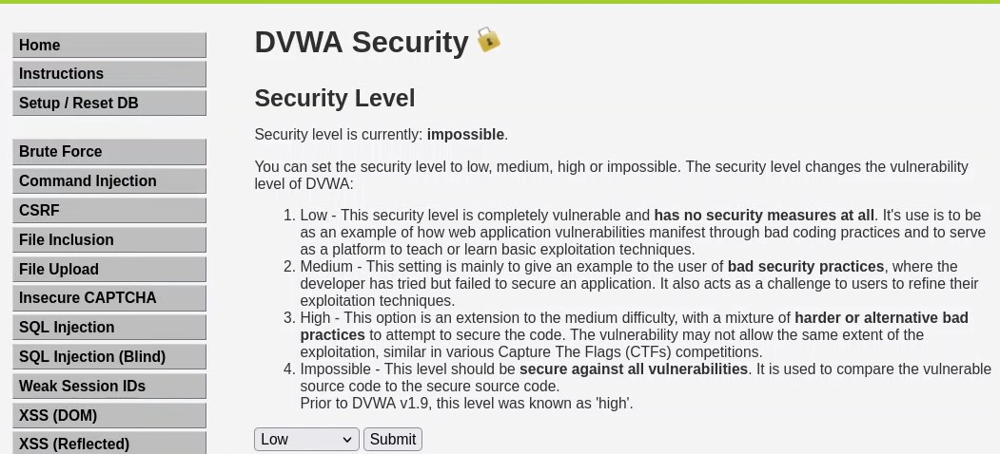
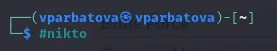
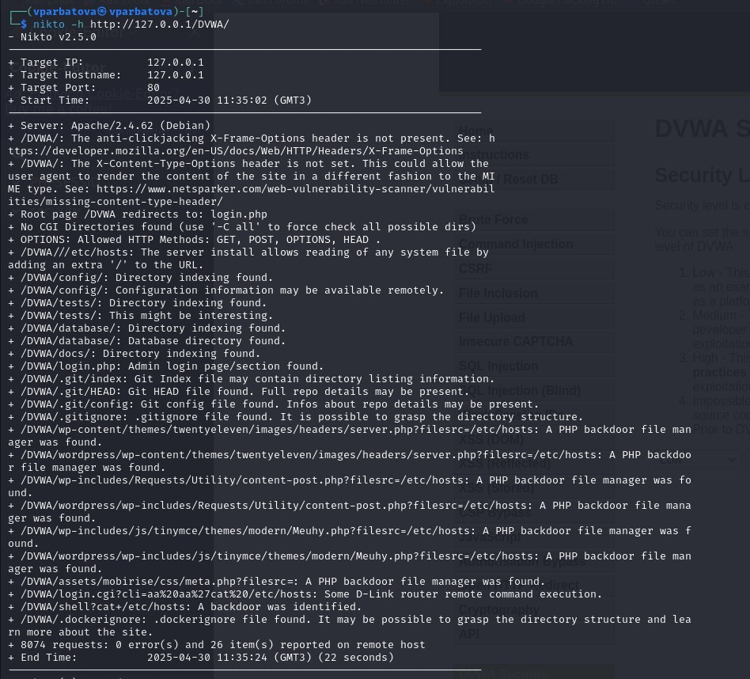
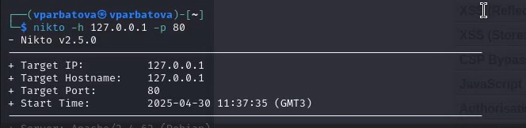

---
## Front matter
title: "Отчёт по четвертому этапу индивидуального проекта"
subtitle: "Информационная безопасность"
author: "Арбатова Варвара Петровна"

## Generic otions
lang: ru-RU
toc-title: "Содержание"

## Bibliography
bibliography: bib/cite.bib
csl: pandoc/csl/gost-r-7-0-5-2008-numeric.csl

## Pdf output format
toc: true # Table of contents
toc-depth: 2
lof: true # List of figures
lot: true # List of tables
fontsize: 12pt
linestretch: 1.5
papersize: a4
documentclass: scrreprt
## I18n polyglossia
polyglossia-lang:
  name: russian
  options:
	- spelling=modern
	- babelshorthands=true
polyglossia-otherlangs:
  name: english
## I18n babel
babel-lang: russian
babel-otherlangs: english
## Fonts
mainfont: IBM Plex Serif
romanfont: IBM Plex Serif
sansfont: IBM Plex Sans
monofont: IBM Plex Mono
mathfont: STIX Two Math
mainfontoptions: Ligatures=Common,Ligatures=TeX,Scale=0.94
romanfontoptions: Ligatures=Common,Ligatures=TeX,Scale=0.94
sansfontoptions: Ligatures=Common,Ligatures=TeX,Scale=MatchLowercase,Scale=0.94
monofontoptions: Scale=MatchLowercase,Scale=0.94,FakeStretch=0.9
mathfontoptions:
## Biblatex
biblatex: true
biblio-style: "gost-numeric"
biblatexoptions:
  - parentracker=true
  - backend=biber
  - hyperref=auto
  - language=auto
  - autolang=other*
  - citestyle=gost-numeric
## Pandoc-crossref LaTeX customization
figureTitle: "Рис."
tableTitle: "Таблица"
listingTitle: "Листинг"
lofTitle: "Список иллюстраций"
lotTitle: "Список таблиц"
lolTitle: "Листинги"
## Misc options
indent: true
header-includes:
  - \usepackage{indentfirst}
  - \usepackage{float} # keep figures where there are in the text
  - \floatplacement{figure}{H} # keep figures where there are in the text
---

# Цель работы

Научиться тестированию веб-приложений с помощью сканера nikto

# Задание

Использование nikto.

# Теоретическое введение

nikto — базовый сканер безопасности веб-сервера. Он сканирует и обнаруживает уязвимости в веб-приложениях, обычно вызванные неправильной конфигурацией на самом сервере, файлами, установленными по умолчанию, и небезопасными файлами, а также устаревшими серверными приложениями. Поскольку nikto построен исключительно на LibWhisker2, он сразу после установки поддерживает кросс-платформенное развертывание, SSL (криптографический протокол, который подразумевает более безопасную связь), методы аутентификации хоста (NTLM/Basic), прокси и несколько методов уклонения от идентификаторов. Он также поддерживает перечисление поддоменов, проверку безопасности приложений (XSS, SQL-инъекции и т. д.) и способен с помощью атаки паролей на основе словаря угадывать учетные данные авторизации.

Для запуска сканера nikto введите в командную строку терминала команду: # nikto

По умолчанию, как ранее было показано в других приложениях, при обычном запуске команды отображаются различные доступные параметры. Для сканирования цели введите nikto -h <цель> -p <порт>, где <цель> — домен или IP-адрес целевого сайта, а <порт> — порт, на котором запущен сервис

Сканер nikto позволяет идентифицировать уязвимости веб-приложений, такие как раскрытие информации, инъекция (XSS/Script/HTML), удаленный поиск файлов (на уровне сервера), выполнение команд и идентификация программного обеспечения. В дополнение к показанному ранее основному сканированию nikto позволяет испытателю на проникновение настроить сканирование конкретной цели. Рассмотрим параметры, которые следует использовать при сканировании.

Указав переключатель командной строки -T с отдельными номерами тестов, можно настроить тестирование конкретных типов.
Используя при тестировании параметр -t, вы можете установить значение тайм-аута для каждого ответа.
Параметр -D V управляет выводом на экран.
Параметры -o и -F отвечают за выбор формата отчета сканирования.
Существуют и другие параметры, такие как -mutate (угадывать поддомены, файлы, каталоги и имена пользователей), -evasion (обходить фильтр идентификаторов) и -Single (для одиночного тестового режима), которые можно использовать для углубленной оценки цели [@parasram].

# Выполнение лабораторной работы

Чтобы работать с nikto, необходимо подготовить веб-приложение, которое будем сканировать. Это будет DVWA. Для этого запустила apache2 (рис. [-@fig:001]).

{#fig:001 width=70%}

Ввожу в адресной строке браузера адрес DVWA, перехожу в режим выбора уровня безопасности, ставлю минимальный (необязательно, nikto при обычном сканировании для режима impossible и low выдаст одинаковые потенциальные уязвимости, что логично, ведь они остаются, но изменяется сложность, с которой их можно использовать)

{#fig:001 width=70%}

Запуск nikto

{#fig:001 width=70%}

Проверить веб-приложение можно, введя его полный URL и не вводя порт, попробовала просканировать так

{#fig:001 width=70%}

Затем попробовала просканировать введя адрес хоста и адрес порта, результаты незначительно отличаются

{#fig:001 width=70%}

# Анализ результатов сканирования

Кроме адреса хоста и порта веб-приложения, никто выводит инофрмацию о различных уязвимостях приложения:

Сервер: Apache/2.4.58 (Debian)

/DVWA/: Заголовок X-Frame-Options, защищающий от перехвата кликов, отсутствует. Смотрите: https://developer.mozilla.org/en-US/docs/Web/HTTP/Headers/X-Frame-Options

/DVWA/: Заголовок X-Content-Type-Options не задан. Это может позволить пользовательскому агенту отображать содержимое сайта способом, отличным от MIME-типа. Смотрите: https://www.netsparker.com/web-vulnerability-scanner/vulnerabilities/missing-content-type-header/

Корневая страница /DVWA перенаправляет на: login.php

Каталоги CGI не найдены (используйте '-C all', чтобы принудительно проверить все возможные каталоги)

ОПЦИИ: Разрешенные HTTP-методы: GET, POST, OPTIONS, HEAD .

/DVWA///etc/hosts: Установка сервера позволяет считывать любой системный файл, добавляя дополнительный "/" к URL-адресу.

/DVWA/config/: Найдена индексация каталога.

/DVWA/config/: Информация о конфигурации может быть доступна удаленно.

/DVWA/tests/: Найдена индексация каталога.

/DVWA/tests/: Это может быть интересно.

/DVWA/database/: Найдена индексация каталога.

/DVWA/база данных/: Найден каталог базы данных.

/DVWA/документы/: Найдена индексация каталога.

/DVWA/login.php: Найдена страница входа администратора/раздел.

/DVWA/.git/index: Индексный файл Git может содержать информацию о списке каталогов.

/DVWA/.git/HEAD: Найден файл Git HEAD. Может содержаться полная информация о репозитории.

/DVWA/.git/config: Найден конфигурационный файл Git. Может содержаться информация о деталях репозитория.

/DVWA/.gitignore: найден файл .gitignore. Можно разобраться в структуре каталогов.

/DVWA/wp-content/themes/twentyeleven/images/headers/server.php?filesrc=/etc/hosts: Обнаружен файловый менеджер с бэкдором на PHP.

/DVWA/wordpress/wp-content/themes/twentyeleven/images/headers/server.php?filesrc=/etc/hosts: Обнаружен файловый менеджер с бэкдором на PHP.

/DVWA/wp-includes/Requests/Utility/content-post.php?filesrc=/etc/hosts: Найден файловый менеджер с бэкдором на PHP.

/DVWA/wordpress/wp-includes/Requests/Utility/content-post.php?filesrc=/etc/hosts: Найден файловый менеджер с бэкдором на PHP.

/DVWA/wp-включает в себя/js/tinymce/themes/modern/Meuhy.php?filesrc=/etc/hosts: Найден файловый менеджер бэкдора PHP.

/DVWA/wordpress/wp-включает в себя/js/tinymce/themes/modern/Meuhy.php?filesrc=/etc/hosts: Найден файловый менеджер бэкдора на PHP.

/DVWA/assets/mobirise/css/meta.php?filesrc=: Найден файловый менеджер бэкдора на PHP.

/DVWA/login.cgi?cli=aa%20aa%27cat%20/etc/hosts: Удаленное выполнение какой-либо команды маршрутизатором D-Link.

/DVWA/shell?cat+/etc/hosts: Обнаружен черный ход.

/DVWA/.dockerignore: найден файл .dockerignore. Возможно, удастся разобраться в структуре каталогов и узнать больше о сайте.

Бэкдор, тайный вход (от англ. back door — «чёрный ход», «лазейка», буквально «задняя дверь») — дефект алгоритма, который намеренно встраивается в него разработчиком и позволяет получить несанкционированный доступ к данным или удалённому управлению операционной системой и компьютером в целом.

Также в результатах nikto отображает код OSVDB 561 и дает ссылку на CVE-2003-1418. OSVDB — это аббревиатура базы данных уязвимостей с открытым исходным кодом.

CVE-2003-1418 — это уязвимость в Apache HTTP Server 1.3.22–1.3.27 на OpenBSD, которая позволяет удалённым злоумышленникам получать конфиденциальную информацию через:

Заголовок ETag, который раскрывает номер вode.

Многочастную границу MIME, которая раскрывает идентификаторы дочерних процессов (PID).

В настоящее время эта проблема имеет среднюю степень тяжести.

# Выводы

Научилась использовать сканер nikto для тестирования веб-приложений

# Список литературы{.unnumbered}

::: {#refs}
:::
