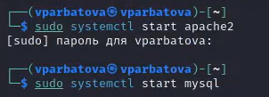
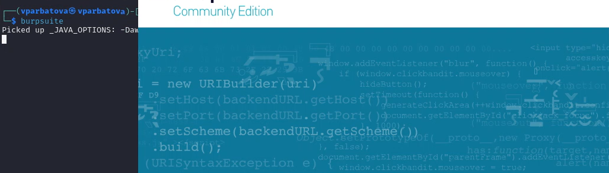
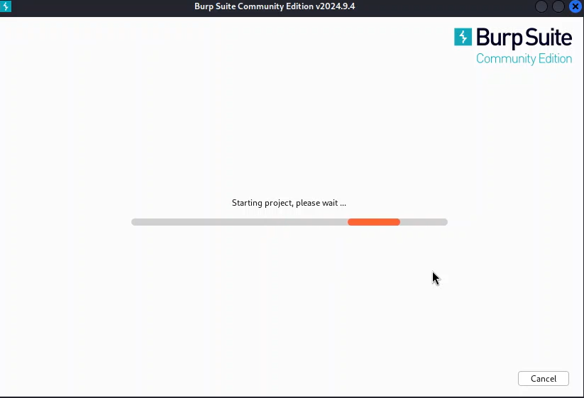

---
## Front matter
lang: ru-RU
title: Презентация по пятому этапу индивидуального проекта
subtitle: Информационная безопасность
author:
  - Арбатова В. П.
institute:
  - Российский университет дружбы народов, Москва, Россия
date: 16 мая 2025

## i18n babel
babel-lang: russian
babel-otherlangs: english

## Formatting pdf
toc: false
toc-title: Содержание
slide_level: 2
aspectratio: 169
section-titles: true
theme: metropolis
header-includes:
 - \metroset{progressbar=frametitle,sectionpage=progressbar,numbering=fraction}
---

# Цель работы

Научиться использовать Burp Suite.

# Теоретическое введение

Burp Suite представляет собой набор мощных инструментов безопасности веб-приложений, которые демонстрируют реальные возможности злоумышленника, проникающего в веб-приложения. Эти инструменты позволяют сканировать, анализировать и использовать веб-приложения с помощью ручных и автоматических методов. Интеграция интерфейсов этих инструментов обеспечивает полную платформу атаки для обмена информацией между одним или несколькими инструментами, что делает Burp Suite очень эффективной и простой в использовании платформой для атаки веб-приложений. [@parasram].

# Выполнение лабораторной работы

##

Запускаю локальный сервер, на котором открою веб-приложение DVWA для тестирования инструмента Burp Suite (рис. [-@fig:001]).

{#fig:001 width=70%}

##

Запускаю инструмент Burp Suite (рис. [-@fig:002]).

{#fig:001 width=70%}

##

Запуск

{#fig:001 width=70%}

##

Изменение настроек сервера для работы с proxy и захватом данных с помощью Burp Suite (рис. [-@fig:004]).

{#fig:001 width=70%}

##

Изменяю настройки Proxy инструмента Burp Suite для дальнейшей работы (рис. [-@fig:005]).

{#fig:001 width=70%}

##

В итоге ничего не получилось

# Выводы

Научилась использовать Burp Suite.
