---
## Front matter
lang: ru-RU
title: Презентация по лабораторной работе №1
subtitle: Основы информационной безопасности
author:
  - Арбатова В.П.
institute:
  - Российский университет дружбы народов, Москва, Россия
date: 21 февраля 2025

## i18n babel
babel-lang: russian
babel-otherlangs: english

## Formatting pdf
toc: false
toc-title: Содержание
slide_level: 2
aspectratio: 169
section-titles: true
theme: metropolis
header-includes:
 - \metroset{progressbar=frametitle,sectionpage=progressbar,numbering=fraction}
---

# Цель работы

 Целью данной работы является приобретение практических навыков установки операционной системы на виртуальную машину,настройки минимально необходимых для дальнейшей работы сервисов

# Теоретическое введение

Лабораторная работа подразумевает установку на виртуальную машину VirtualBox(https://www.virtualbox.org/)операционной системы Linux (дистрибутив Rocky (https://rockylinux.org/)).
Выполнение работы возможно как в дисплейном классе факультета физико-математических и естественных наук РУДН, так и дома. Описание выполнения работы приведено для дисплейного класса со следующими характеристиками:– Intel Core i3-550 3.2 GHz, 4 GB оперативной памяти, 20 GB свободного места на жёстком диске;– ОСLinuxGentoo(http://www.gentoo.ru/);– VirtualBox верс.6.1 или старше;– каталог с образами ОС для работающих в дисплейном классе: /afs/dk.sci.pfu.edu.ru/common/files/iso/.

# Выполнение лабораторной работы

## Создание и настройка виртуальной машины

# Создаю виртуальную машину

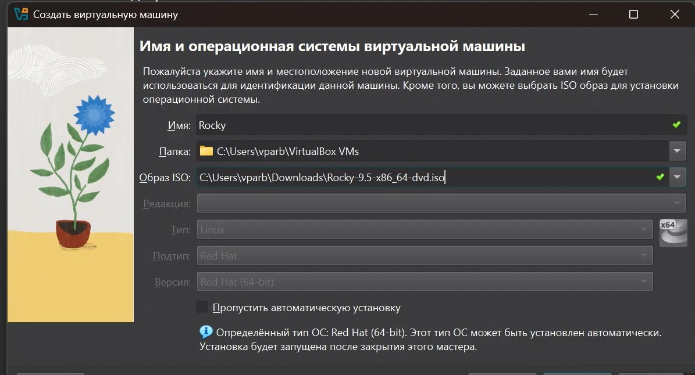{#fig:001 width=70%}

# Согласно соглашению об именовании даю имя пользователя и компьютера, ввожу пароль

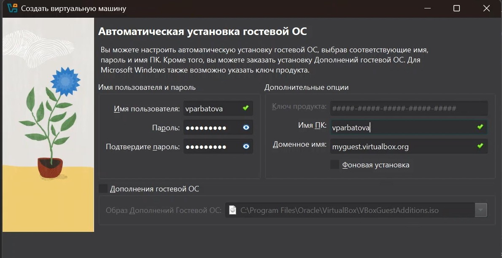{#fig:001 width=70%}

# Настраиваю количество оперативной памяти и процессоров

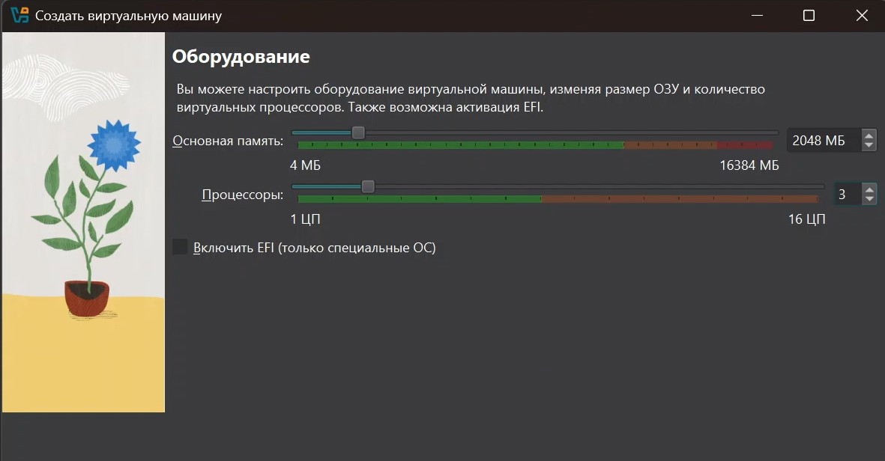{#fig:001 width=70%}

# Выделяю место для виртуального жесткого диска

{#fig:001 width=70%}

# Выбираю язык установки

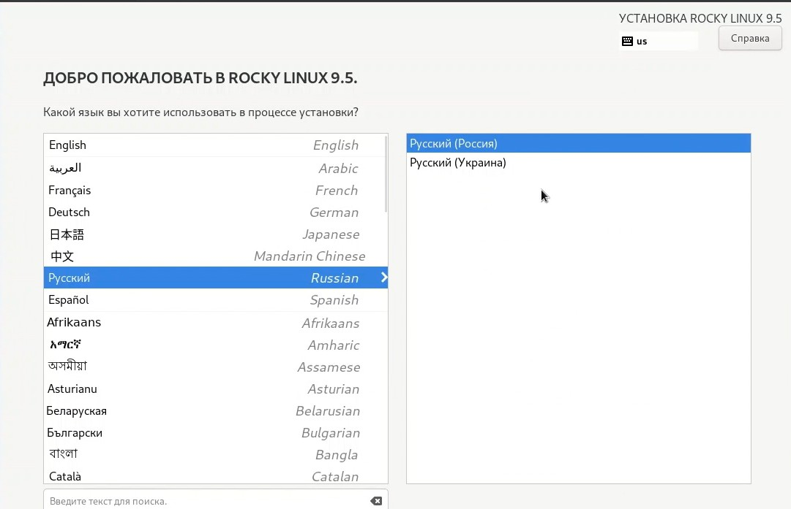{#fig:001 width=70%}

# Задаю пароль root

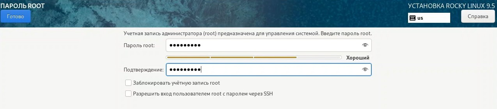{#fig:001 width=70%}

# Создаю пользователя, удовлетворяющего соглашению об именовании

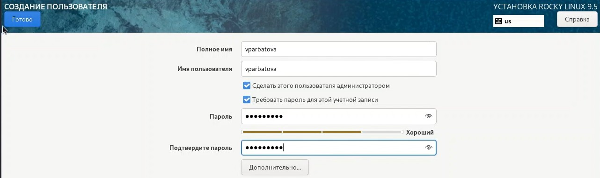{#fig:001 width=70%}

# Произвожу выбор программ

{#fig:001 width=70%}

# Выключаю KDUMP

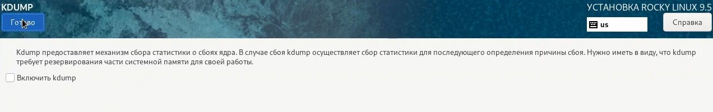{#fig:001 width=70%}

# Меняю имя узла

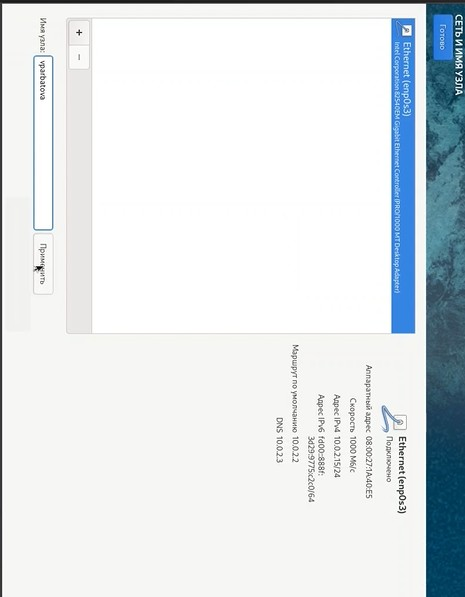{#fig:001 width=70%}

# Запускаю машину

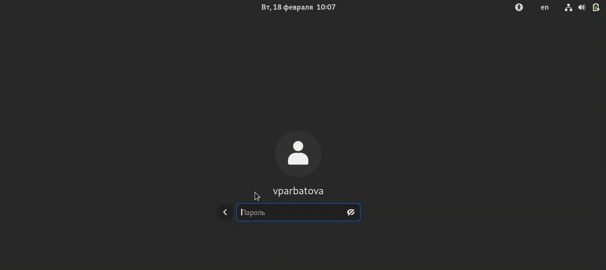{#fig:001 width=70%}

# Проверяю что диск отключен

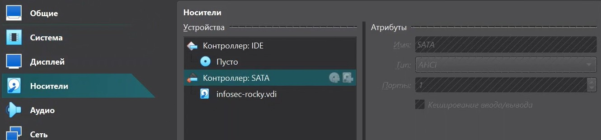{#fig:001 width=70%}

# Выполнение домашнего задания

# В окне терминала анализирую последовательность загрузки системы, выполнив команду dmesg

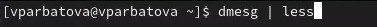{#fig:001 width=70%}

# Версия ядра линукс, частота процессора, модель процессора

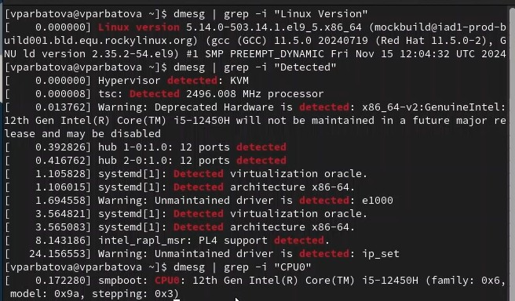{#fig:001 width=70%}

# Память

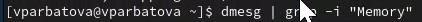{#fig:001 width=70%}

# Тип обнаруженного гипервизора

{#fig:001 width=70%}

# sudo fdish -l показывает тип файловой системы, типа Linux, Linux LVM

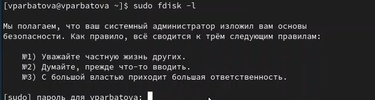{#fig:001 width=70%}

# Последовательность монтирования файловых систем

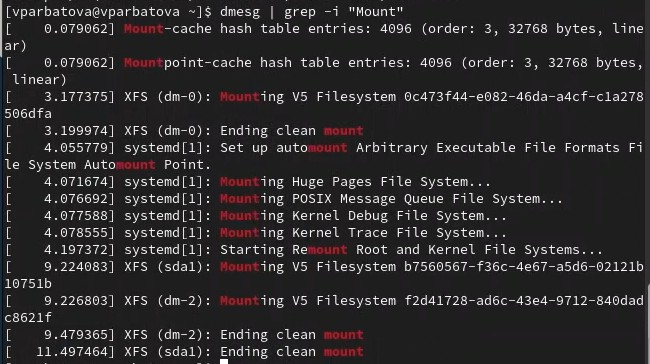{#fig:001 width=70%}

# Выводы

Мной была установлена и настроена виртуальная машина

:::

